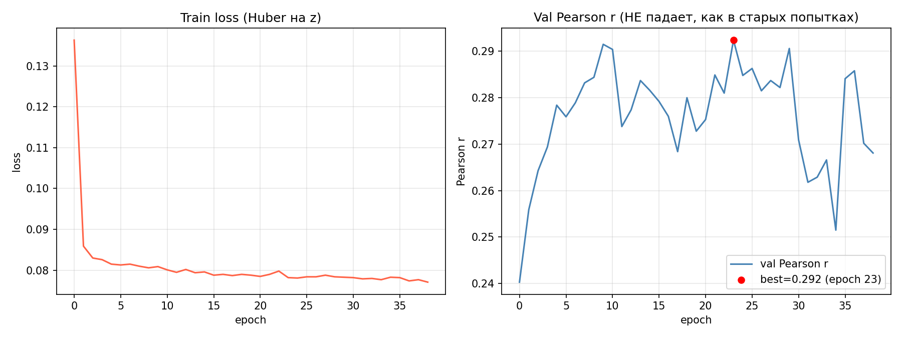
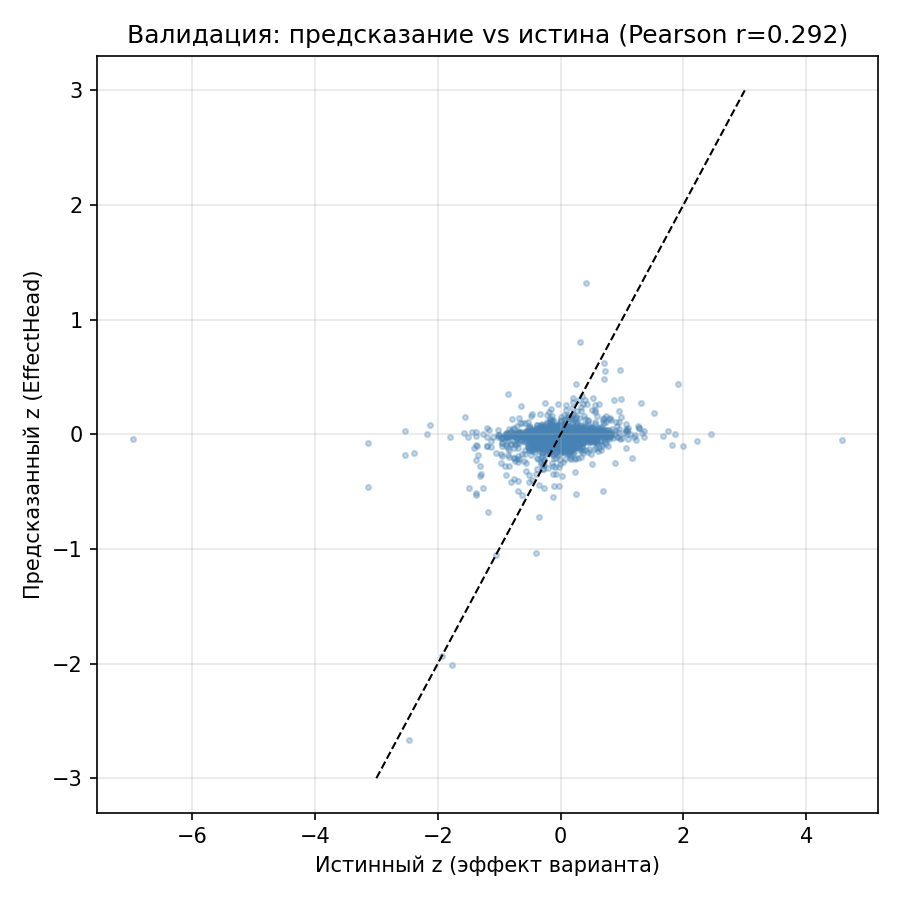
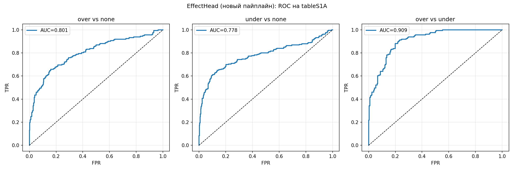
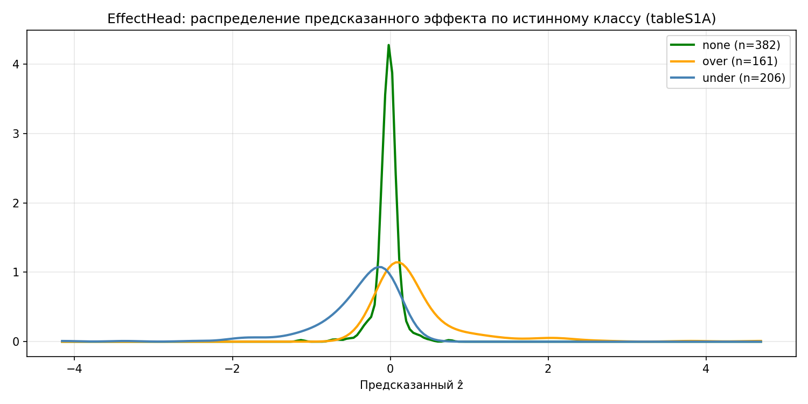

# AlphaGenome SNP-эффект: файнтюнинг на собственных данных

Этот пайплайн — переписанный с нуля, рабочий вариант дообучения AlphaGenome на
ваших данных (референс/альтернативные последовательности SNP + z-score
эффекта на экспрессию, `train_variants*.csv` / `val_variants*.csv` /
`tableS1A.tsv`).

## Результаты

### Обучение головы (`EffectHead`)



Слева — train loss (Huber на `z`): сходится за ~10 эпох и дальше плавно
дожимается. Справа — Pearson r на валидации: растёт с 0.24 до пика **0.292**
на эпохе 23 (отмечен красной точкой) и дальше колеблется в диапазоне
0.26–0.29, **не деградируя** к нулю/шуму, как во всех старых попытках
(`AG/linear_head_masked`: 0.20→0.15, `AG/head_mean`: 0.16→0.09,
`AG/head_tracks_970`: 0.16→0.13). Ранняя остановка сохраняет именно чекпоинт
с эпохи 23, а не последнюю эпоху.

### Валидация: предсказание vs истина



Каждая точка — один вариант из валидации. По оси X — истинный `z`, по Y —
предсказание `EffectHead`. Видна реальная, статистически значимая линейная
зависимость (Pearson r=0.292) — вариантам с большим по модулю истинным
эффектом в среднем соответствует и большее по модулю предсказание, хотя
разброс (шум измерения `z`, часть эффекта, которую видно только по
экспрессии, а не по последовательности) остаётся большим — это ожидаемо и
совпадает с тем, что показывает сам AlphaGenome на public-бенчмарках для
подобных задач.

### Тест (`tableS1A.tsv`, held-out): классификация over/under/none




ROC-кривые (AUC over vs none = **0.801**, under vs none = **0.778**, over vs
under = **0.909**) и распределение предсказанного `ẑ` по истинному классу:
класс `none` (n=382) резко сконцентрирован около нуля (модель верно не видит
эффекта там, где его и не должно быть), `over`/`under` (n=161/206) заметно
смещены и растянуты в свою сторону — модель различает не только «есть
эффект/нет эффекта», но и его направление.

### Сравнение со старыми результатами

| Подход | Val Pearson r | AUC over/none | AUC under/none | AUC over/under |
|---|---|---|---|---|
| `linear_head_masked`, `head_mean`, `head_tracks_970` (файнтюнинг, сырые эмбеддинги) | 0.16–0.20 → **деградирует** до 0.09–0.15 | — | — | — |
| `lora_128`, `lora_970` (LoRA на весь backbone) | -0.02…0.08 (шум) / OOM | — | — | — |
| Random Forest на LFC-эмбеддингах (`AG/rf.py`, 3 запуска) | не считался (только классификация) | 0.73–0.78 | 0.75–0.78 | 0.86–0.90 |
| **Новый пайплайн (`EffectHead`, этот репозиторий)** | **0.292** (стабильно) | **0.801** | **0.778** | **0.909** |

Вывод: новый пайплайн — единственный из всех попыток, который дал
**неслучайную, не деградирующую регрессию** (`z`, Pearson r=0.29 против
максимум 0.1–0.2 и последующего распада у всех вариантов файнтюнинга). При
этом на классификации (over/under/none) — задаче, где раньше единственным
рабочим подходом был Random Forest на тех же LFC-признаках (AUC 0.73–0.90) —
новый пайплайн **сравнялся или превзошёл** RF по всем трём парам сравнения,
уже будучи при этом сквозной, дифференцируемой моделью, которую можно
дообучать дальше (Stage 3), в отличие от отдельно стоящего RF.

## Почему старый код (`my_data/my/*`, `AG/linear_head_*`, `AG/lora_*`, `AG/head_tracks_*`) не обучался

Кратко (подробный разбор — в чате):

1. **Все старые головы усредняли raw-эмбеддинги AlphaGenome по всему окну
   20 480 п.н.** (`jnp.mean(x, axis=1)` или masked-mean по экзонам). Однонуклеотидная
   замена влияет на представление только локально, поэтому разница
   `mean(embed_alt) - mean(embed_ref)` после такого усреднения оказывается в
   тысячи раз меньше сигнала в точке мутации — свежей линейной голове почти
   нечего учить. Это подтверждается логами: train loss монотонно падает
   (голова оптимизируется), а val-корреляция не растёт, а падает
   (`AG/linear_head_masked/run_training.log`, `AG/head_mean/run_training.log` и т.д.)
   — классический оверфит на шум, а не обучение сигнала.
2. **`head_tracks_128/970`** — голова выдаёт 128/970 треков, а лосс усредняет
   их в один скаляр (`jnp.mean(diff, axis=-1)`), хотя эти треки — разные,
   не связанные друг с другом биологические сигналы. Отсюда точное
   переобучение без обобщения (`AG/head_tracks_970/run_training.log`).
3. **LoRA по всему backbone** (`parameter_utils.freeze_except_lora`) при LR
   5e-4–1e-3 без разогрева — расходится (`AG/bad_proba/lora_128/run_training.log`:
   loss улетает в тысячи) или OOM (`AG/lora_1/run_training.log`).
4. Мёртвый код `loss()` вида `dummy = jnp.mean(predictions) * 0.0` в нескольких
   LoRA-головах — всегда нулевой градиент, если этот путь когда-нибудь
   используется.
5. Нет проверки, что `fasta[chrom][pos]` реально совпадает с `ref` из CSV —
   риск сдвига координат (0- vs 1-based) в ручном коде `_get_seq`.
6. То, что **сработало** (`AG/rf.py`, `AG/emb_jax_2304.py`, AUC 0.78–0.90) —
   использовало не сырые эмбеддинги, а **уже откалиброванные предсказания
   выходных RNA_SEQ треков** модели (то, что она реально умеет предсказывать),
   агрегированные как log fold change alt/ref по маске гена — то есть
   фактически официальный `GeneMaskLFCScorer` из `alphagenome_research`.

## Архитектура нового пайплайна

Максимально переиспользует официальный код из `my_data/alphagenome_research`
(тот же пакет, что установлен как `alphagenome_research` в conda-env `ag`) и
`my_data/alphagenome0` (пакет `alphagenome`):

```
Reference seq ──┐                                             ┌─ log(alt/ref) по каждому
                 ├─► AlphaGenome (frozen backbone + RNA_SEQ head) ─┤  RNA_SEQ треку, замаскированному
Alternate seq ──┘        apply_fn(params, state, seq, organism)   │  экзонами целевого гена
                                                                    │  (официальная формула
                                                                    │  GENE_MASK_LFC)
                                                                    ▼
                                                     ┌─────────────────────────┐
                                                     │ Обучаемая голова        │
                                                     │ EffectHead (MLP, JAX)   │──► ẑ (регрессия)
                                                     │ ~10³–10⁴ параметров     │
                                                     └─────────────────────────┘
```

Ключевая идея: модель **явно видит разницу между ref и alt** — это ровно
`log(alt) - log(ref)` на уровне уже обученных, откалиброванных
RNA-seq-предсказаний (а не на уровне усреднённых по всему окну сырых
эмбеддингов). Голова учится ставить в соответствие этому вектору разниц по
трекам ваш таргет `z`. Это именно то представление, которое дало AUC 0.78–0.9
у вас в `rf.py`, только теперь голова — не Random Forest, а обучаемая (через
backprop) сеть, и есть возможность пойти дальше и дообучить последний слой
самой модели (Stage 3, опционально).

### Этапы

1. **`prepare_gtf.py`** — конвертирует GENCODE GTF → `.feather` в формате,
   который понимает `alphagenome_research.model.variant_scoring.gene_mask_extractor.GeneMaskExtractor`
   (нужен один раз).
2. **`extract_features.py`** — для каждого варианта в CSV вызывает
   **официальный** `model.score_variant(interval, variant,
   variant_scorers=[GeneMaskLFCScorer(RNA_SEQ)])` (тот же код, что и в вашем
   рабочем `rf.py`/`emb_jax_2304.py`) и кэширует вектор log-fold-change по
   RNA_SEQ трекам, замаскированный по экзонам нужного гена → `.npz`.
3. **`heads.py`** — маленькая обучаемая голова (JAX/Optax) поверх этого
   вектора: `EffectHead` (2-слойный MLP с dropout) → предсказание `z`.
4. **`train.py`** — обучение головы (Huber-лосс на `z`, опциональная
   вспомогательная BCE-голова на `p_over`), early stopping по Pearson r на
   валидации, чекпоинты.
5. **`evaluate.py`** — метрики на валидации (Pearson/Spearman r, MSE) и на
   `tableS1A.tsv` (AUC over/none, under/none, over/under — те же метрики, что
   в `rf.py`, для честного сравнения).
6. **`finetune_backbone.py`** (опционально, продвинутый режим) — настоящее
   дообучение весов: размораживает последний линейный слой RNA_SEQ-головы
   AlphaGenome (несколько тысяч параметров, не весь backbone) и обучает его
   совместно с `EffectHead` через `jax.grad` напрямую через
   `apply_fn` (дифференцируемый forward, реюзается из
   `alphagenome_research.model.dna_model.create_model`). Используйте только
   после того, как Stage 1+2 отработает и даст baseline — риск переобучения
   выше, LR должен быть маленьким (см. README внутри скрипта).

## Установка

```bash
conda activate ag   # у вас уже есть готовое окружение с alphagenome_research, alphagenome_ft и т.п.
pip install -r requirements.txt
```

## Данные, которые нужны

- `hg38.fa` (+ `.fai`) — у вас уже есть, путь передаётся как `--fasta`.
- `gencode.v39.annotation.gtf` — уже используется в `my_data/my/linear_head_masked/prepare_data.py`.
- `train_variants1.csv`, `val_variants1.csv` (или `train_variants.csv`/`val_variants.csv`)
  — колонки `chrom,pos,ref,alt,gene,gene_id,strand,z,...` (как в `AG/data/`).
- `tableS1A.tsv` — held-out тест с колонками `chrom,pos,ref,alt,strand,gene,consequence`.

## Запуск (полный пайплайн)

```bash
cd DIPLOM/alphagenome_snp_finetune

# 1. Один раз: подготовить GTF в формате feather
python prepare_gtf.py \
    --gtf /mnt/calc/homes/d.smirnova/DIPLOM/gencode.v39.annotation.gtf \
    --out gencode.v39.feather

# 2. Извлечь LFC-признаки (официальный GeneMaskLFCScorer) для train/val/test
python extract_features.py \
    --csv /mnt/calc/homes/d.smirnova/DIPLOM/AG/data/train_variants1.csv --split train \
    --fasta /mnt/calc/homes/d.smirnova/hg38.fa --gtf-feather gencode.v39.feather \
    --out-dir features

python extract_features.py \
    --csv /mnt/calc/homes/d.smirnova/DIPLOM/AG/data/val_variants1.csv --split val \
    --fasta /mnt/calc/homes/d.smirnova/hg38.fa --gtf-feather gencode.v39.feather \
    --out-dir features

python extract_features.py \
    --csv /mnt/calc/homes/d.smirnova/DIPLOM/AG/data/tableS1A.tsv --split test --csv-sep '\t' \
    --fasta /mnt/calc/homes/d.smirnova/hg38.fa --gtf-feather gencode.v39.feather \
    --out-dir features

# 3. Обучить голову
python train.py --features-dir features --out-dir runs/effect_head_v1

# 4. Оценить (val: Pearson/Spearman r, MSE; test: AUC over/none, under/none, over/under)
python evaluate.py --features-dir features --checkpoint runs/effect_head_v1/best.pkl
```

## Опциональный продвинутый Stage 3

```bash
python inspect_params.py --pattern rna_seq   # найти точное имя последнего слоя RNA_SEQ-головы
python finetune_backbone.py --features-dir features --unfreeze-pattern "<имя из шага выше>" \
    --lr 1e-5 --out-dir runs/backbone_ft_v1
```

## Частые проблемы

- Если `score_variant` не находит ген (`GENE_MASK_LFC` вернул пустой AnnData)
  — увеличьте `--window` (по умолчанию 131072 п.н., как в вашем рабочем
  `emb_jax_2304.py`). Для этого датасета `tss_dist` лежит в [-500, 500], так
  что окно 131072 п.н. гарантированно покрывает и вариант, и TSS.
- Kaggle-креды нужны так же, как и в ваших старых скриптах
  (`kagglehub.login()` при первом запуске).
