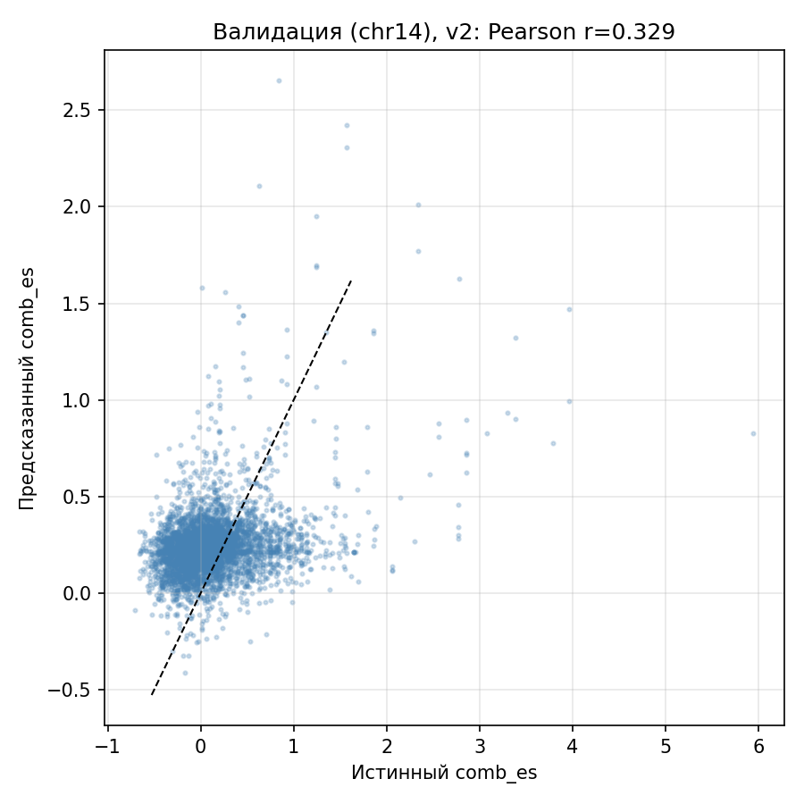
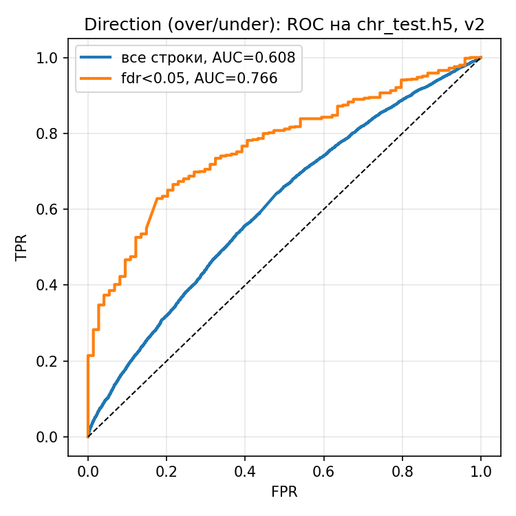
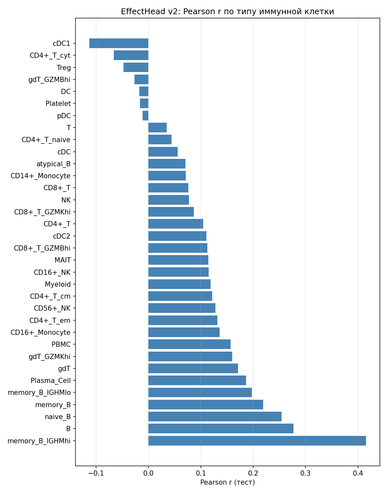
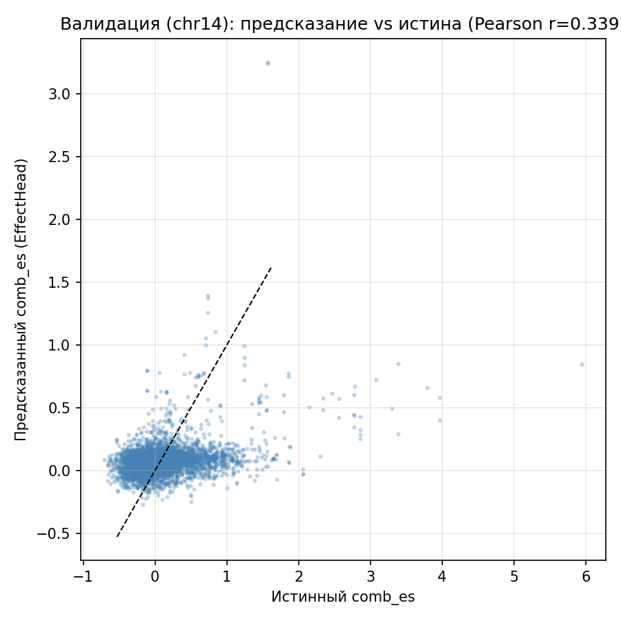
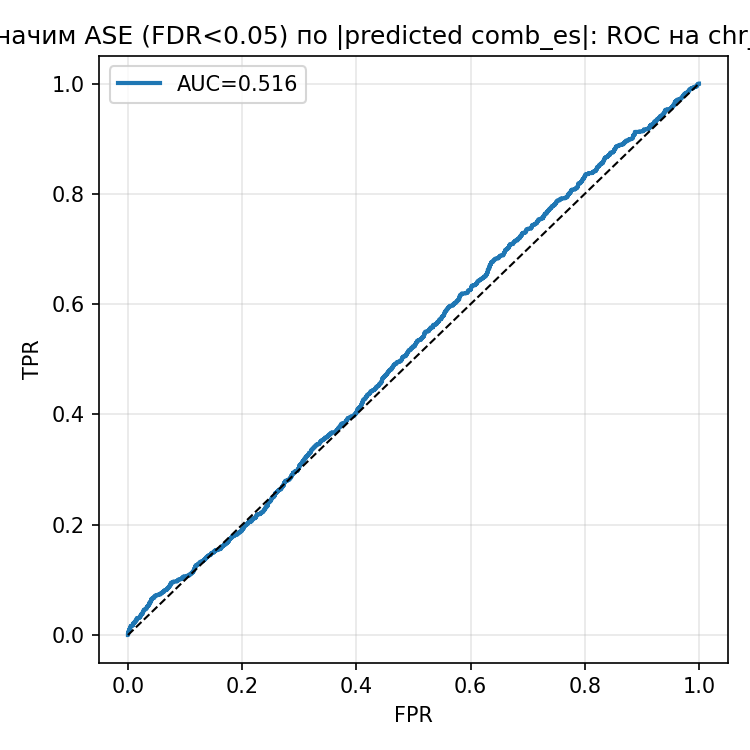
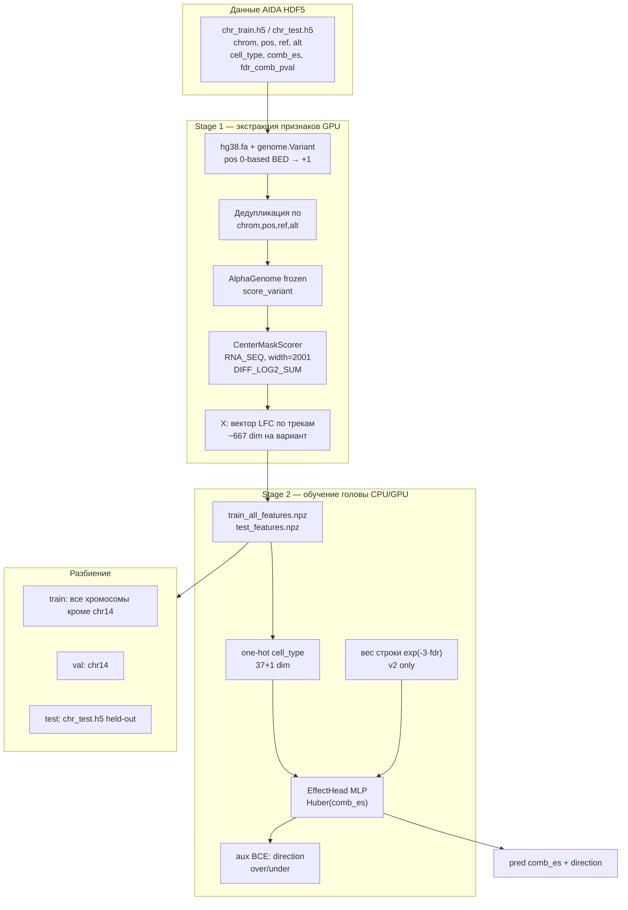

# AlphaGenome на иммунных ASE-данных AIDA

Пайплайн для предсказания **allele-specific expression (ASE)** по данным
Asian Immune Diversity Atlas (AIDA): однонуклеотидные варианты в
периферических мононуклеарных клетках, таргет **`comb_es`** (combined effect
size из MIXALIME) и **`fdr_comb_pval`**, **37 типов иммунных клеток**
(`cell_type`).

Источник данных: `chr_data/chr_train.h5`, `chr_data/chr_test.h5`.

---

## Результаты (рекомендуемая модель: `train_immune_v2.py`)

### Метрики на held-out тесте (`chr_test.h5`)

| Метрика | v1 (`train_immune.py`) | **v2 (`train_immune_v2.py`)** | Курсовая: RF на эмбеддингах |
|---|---|---|---|
| Pearson r, все строки | 0.185 | **0.187** | — |
| Pearson r, только FDR &lt; 0.05 | 0.276 | **0.331** | — |
| AUC direction (over/under), все | 0.601 | **0.608** | — |
| **AUC direction, FDR &lt; 0.05** | 0.694 | **0.766** | **0.763** |

**Direction** — бинарная задача из курсовой: `comb_es > 0` → under,
`comb_es < 0` → over (знак эффекта аллеля).

Валидация (отложенная хромосома **chr14**): Pearson r = **0.329** (v2);
на подмножестве FDR &lt; 0.05 на вале — r ≈ **0.62**.

> **Важно про AUC «значимости ASE» (~0.52 у v1):** предсказывать
> `fdr_comb_pval < 0.05` только по последовательности **нельзя** — FDR
> зависит от глубины покрытия и числа клеток/доноров, а не от ДНК-контекста.
> В v2 aux-голова переобучена на **direction**, как в курсовой.

### Обучение v2 (TensorBoard: `runs/effect_head_immune_v2/tensorboard`)

На валидации v2 дополнительно логирует `val/direction_auc` и
`val/pearson_r_fdr_lt_0.05` — уверенные ASE-вызовы дают более честную
оценку, чем смесь с шумными строками (~94% с FDR ≥ 0.05).

### Валидация: регрессия `comb_es` (v2)



### Тест: ROC direction over/under (v2)



Синяя кривая — все строки (AUC ≈ 0.61); оранжевая — только **FDR &lt; 0.05**
(AUC ≈ **0.77**, сопоставимо с RF из курсовой).

### Pearson r по типам клеток (тест, v2)



Систематически выше на **B-клетках** (`memory_B_IGHMhi`, `B`, `naive_B`);
на редких T-подтипах с малым *n* метрики нестабильны (шум, а не «отсутствие
сигнала»).

### Сравнение с v1 (та же экстракция признаков, другой loss)




---

## Как работает код (схема)



**Поток данных по файлам:**

| Шаг | Скрипт | Вход | Выход |
|---|---|---|---|
| 1 | `extract_features_immune.py` | HDF5 + FASTA | `features_immune/*_features.npz` |
| 2 | `train_immune_v2.py` | NPZ + vocab JSON | `runs/effect_head_immune_v2/best.pkl` |
| 3 | `evaluate_immune_v2.py` | NPZ + checkpoint | метрики + PNG в `analysis_v2/` |

Опционально (эксперимент, как в курсовой «сырые эмбеддинги»):
`extract_embeddings_immune.py` → признак **3072-dim** =
`mean(embeddings_128bp_alt) − mean(embeddings_128bp_ref)` через
`build_embeddings_apply_fn` в `common.py`.

---

## Принципиальные отличия от старого кода (`AG/905_*`, `AG/1305_*`, `AG/emb_jax_immune.py`)

### 1. Учёт `cell_type` (главная ошибка старых попыток файнтюна)

В HDF5 **один и тот же SNP** (одна последовательность) встречается до **37 раз**
с **разным** `comb_es` — по одному на тип клетки.

| Старый код | Новый код |
|---|---|
| `905_finetune_full_immune.py`, `1305_new_finetune_all_immune.py` **не передают** `cell_type` в модель | `one_hot(cell_type)` **конкатенируется** с LFC-признаками |
| Один X → много разных Y без объяснения → **нерешаемый шум**, val corr **NaN** (см. логи) | Голова учит **разные веса по трекам** для B/T/NK/… |

### 2. Что именно подаётся в голову (сигнал ref vs alt)

| Подход | Признак | Проблема / плюс |
|---|---|---|
| Старый файнтюн: MSE на **средней** разности RNA-seq по окну / 128 bp | Размазанный сигнал SNP | Val ~0, NaN |
| `1305_new_finetune_all_immune.py` | `predict(..., resolutions=(128,))` | **TypeError** — скрипт не доходил до обучения |
| `emb_jax_immune.py` | mean по **всему** окну 128 kb, 667 треков, **без** cell_type в RF-пайплайне на диске | AUC direction на тех же фичах + cell_type ≈ **0.67** (мы перепроверили) |
| **Новый `CenterMaskScorer`** | **log2 sum alt/ref** в **2001 п.н.** вокруг варианта по RNA_SEQ трекам | Локальный ASE-сигнал, как в официальных рекомендациях AlphaGenome |
| Курсовой RF **0.763** | Описаны **сырые внутренние эмбеддинги** (скрипт в репо не сохранился); v2 на LFC **догнал** этот AUC (**0.766**) |

### 3. Обучение backbone vs замороженная модель + маленькая голова

Старые скрипты **размораживали** часть AlphaGenome и оптимизировали MSE end-to-end
на шумных таргетах → нестабильность. Новый пайплайн: **backbone frozen**,
обучается только **`EffectHead`** (~10⁴ параметров) на **кэшированных** признаках —
тот же принцип, что дал успех на PromoterAI (`best_code/`).

### 4. Исправления v2 относительно v1 (без смены признаков)

| v1 | v2 | Эффект |
|---|---|---|
| Равный вес всех строк | **Huber × exp(−3·fdr)** | Меньше шума от маломощных ASE |
| aux BCE на **`is_sig`** (FDR) | aux BCE на **direction** | AUC direction (FDR&lt;0.05): **0.69 → 0.77** |
| early stop по Pearson (all) | то же | Pearson на FDR&lt;0.05: **0.28 → 0.33** |

### 5. Инфраструктура (мелочи, но критичные на практике)

- **Координаты:** `position_start` в HDF5 — 0-based BED → **`+1`** для `genome.Variant`.
- **Дедупликация** вариантов при экстракции (~19843 уникальных вместо 81273 прогонов модели).
- **Val по chr14**, тест — отдельный **`chr_test.h5`** (не та же хромосома).
- **TensorBoard** в `train_immune.py` / `train_immune_v2.py`.
- **`load_alphagenome_model`**: локальный kagglehub-кэш без интерактивного login.

---

## Установка и запуск

Conda-env `ag`, зависимости — `requirements.txt` (как в `best_code/`).

```bash
export CUDA_VISIBLE_DEVICES=0
export FASTA=/path/to/hg38.fa
export CHR_TRAIN=/path/to/chr_train.h5
export CHR_TEST=/path/to/chr_test.h5

chmod +x run_immune_v2.sh
./run_immune_v2.sh
```

Или по шагам:

```bash
python extract_features_immune.py --h5 "$CHR_TRAIN" --split train_all \
  --fasta "$FASTA" --out-dir features_immune
python extract_features_immune.py --h5 "$CHR_TEST" --split test \
  --fasta "$FASTA" --out-dir features_immune \
  --vocab-path features_immune/cell_type_vocab.json

python train_immune_v2.py --features-dir features_immune \
  --out-dir runs/effect_head_immune_v2

python evaluate_immune_v2.py --features-dir features_immune \
  --checkpoint runs/effect_head_immune_v2/best.pkl \
  --plots-dir analysis_v2
```

TensorBoard:

```bash
tensorboard --logdir runs/effect_head_immune_v2/tensorboard --bind_all --port 6006
```

---

## Файлы в этой папке

| Файл | Назначение |
|---|---|
| `extract_features_immune.py` | LFC через `CenterMaskScorer` (основной пайплайн) |
| `extract_embeddings_immune.py` | эксперiment: сырые `embeddings_128bp` diff |
| `train_immune.py` | v1 (baseline, aux=is_sig) |
| `train_immune_v2.py` | **рекомендуемое** обучение |
| `evaluate_immune_v2.py` | метрики + графики direction |
| `evaluate_immune.py` | v1 evaluation |
| `heads.py`, `common.py` | общие модули |
| `run_immune.sh`, `run_immune_v2.sh` | оркестрация |
| `analysis/`, `analysis_v2/` | PNG с результатов прогона на сервере |

---

## Связь с `best_code/` (PromoterAI / SNP z-score)

Оба пайплайна используют одну идею: **не** учить backbone с нуля на
усреднённых эмбеддингах, а взять **официальный сигнал ref vs alt**
(`GeneMaskLFCScorer` для генов / `CenterMaskScorer` для ASE без gene_id) и
обучить **`EffectHead`**. Для иммунных данных добавлен обязательный
**`cell_type`**, без которого задача матемatically ill-posed.
