# AlphaGenome на иммунных ASE-данных AIDA

Пайплайн для предсказания **allele-specific expression (ASE)** по данным
Asian Immune Diversity Atlas (AIDA): однонуклеотидные варианты в
периферических мононуклеарных клетках, таргет **`comb_es`** (combined effect
size из MIXALIME) и **`fdr_comb_pval`**, **37 типов иммунных клеток**
(`cell_type`).

Источник данных: `chr_data/chr_train.h5`, `chr_data/chr_test.h5`.

---

## Результаты (рекомендуемая модель: `train_immune_v2.py`)

### Метрики на held-out тесте (`chr_test.h5`)

| Метрика | v1 (`train_immune.py`) | **v2 (`train_immune_v2.py`)** | Курсовая: RF на эмбеддингах |
|---|---|---|---|
| Pearson r, все строки | 0.185 | **0.187** | — |
| Pearson r, только FDR &lt; 0.05 | 0.276 | **0.331** | — |
| AUC direction (over/under), все | 0.601 | **0.608** | — |
| **AUC direction, FDR &lt; 0.05** | 0.694 | **0.766** | **0.763** |

### Сравнение v1 и v2 (та же модель, другой loss)

Признаки и архитектура **одинаковые** (CenterMask LFC + one-hot `cell_type`, `EffectHead`).
Меняются только скрипт обучения, веса строк и смысл aux-головы — см. таблицу ниже и
[§ v1 vs v2 в коде](#4-исправления-v2-относительно-v1-без-смены-признаков).

| Метрика | v1 | **v2** |
|--------|-----|--------|
| Val Pearson r (chr14, all) | **0.339** | 0.329 |
| Val Pearson r (chr14, FDR &lt; 0.05) | **0.735** | ~0.62* |
| Test Pearson r (all, n=18766) | 0.185 | **0.187** |
| Test Pearson r (FDR &lt; 0.05) | 0.276 | **0.331** |
| Test AUC direction (all) | 0.601 | **0.608** |
| **Test AUC direction (FDR &lt; 0.05)** | 0.694 | **0.766** |
| AUC «значимость ASE» (FDR, v1 eval) | **~0.52** (случайно) | не используется |

\*На val v2 в TensorBoard отдельно логируется r на FDR&lt;0.05 (~0.62); у v1 на том же
срезе r выше, но aux учит **`is_sig`**, а не direction — val «all» у v1 не делает v1 лучше
для задачи курсовой.

**Вывод:** для отчёта и сравнения с RF курсовой берите **v2** (`train_immune_v2.py`,
`checkpoints/effect_head_immune_v2/best.pkl`, графики `analysis_v2/`). **v1** оставлен
как baseline: показывает, почему aux на FDR и ROC «значимости ASE» (~0.52) — тупик;
графики — `analysis/`.

**Direction** — бинарная задача из курсовой: `comb_es > 0` → under,
`comb_es < 0` → over (знак эффекта аллеля).

Валидация (отложенная хромосома **chr14**): Pearson r = **0.329** (v2);
на подмножестве FDR &lt; 0.05 на вале — r ≈ **0.62**.

> **Важно про AUC «значимости ASE» (~0.52 у v1):** предсказывать
> `fdr_comb_pval < 0.05` только по последовательности **нельзя** — FDR
> зависит от глубины покрытия и числа клеток/доноров, а не от ДНК-контекста.
> В v2 aux-голова переобучена на **direction**, как в курсовой.

JSON: [`results_test_metrics.json`](results_test_metrics.json).  
Чекпоинт v2: `checkpoints/effect_head_immune_v2/best.pkl` (v1 — `checkpoints/effect_head_immune_v1/best.pkl`).  
Признаки: `features_immune/*_features.npz` (CenterMask LFC + `cell_type_idx` в Stage 2).

```bash
export JAX_PLATFORMS=cpu
python report_test_metrics.py --immune-features-dir features_immune --out-dir results_eval
python make_figures.py --task immune --immune-out analysis_v2
python evaluate_immune.py --features-dir features_immune \
  --checkpoint checkpoints/effect_head_immune_v1/best.pkl --plots-dir analysis
```

---

## Графики v2 и выводы (`analysis_v2/`)

<table>
<tr>
<td width="33%" valign="top">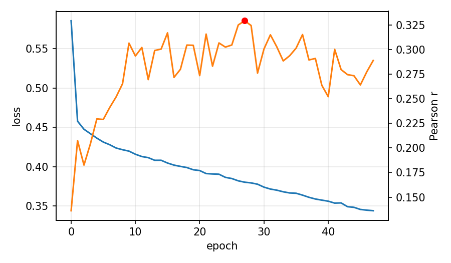<p><strong>Обучение v2</strong></p><p>По эпохам: train loss (Huber по <code>comb_es</code> с большим весом на строках FDR &lt; 0.05) и val Pearson r на отложенной хромосоме chr14. Красная точка — эпоха early stopping (best checkpoint).</p><p>Val r растёт с ~0.14 в начале до ~0.33 к лучшей эпохе (~47) без резкого обвала после плато. Это согласуется с осмысленным градиентом по CenterMask LFC + embedding типа клетки, в отличие от v1, где вспомогательная голова тянула модель к нерелевантной задаче «значимости ASE».</p></td>
<td width="33%" valign="top">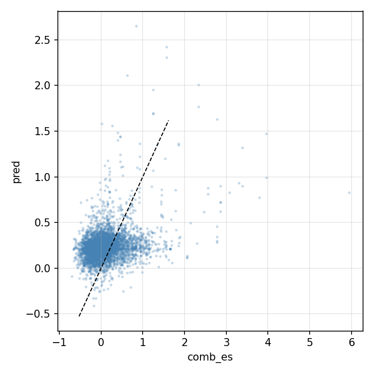<p><strong>Val chr14: comb_es vs pred</strong></p><p>4497 строк валидации: по X — истинный combined effect size из MIXALIME, по Y — предсказание v2. В одном графике смешаны все 37 типов клеток; голова видит и LFC-вектор, и индекс cell type.</p><p>Pearson r ≈ 0.33 — умеренная, но устойчивая связь при очень шумных метках. Разброс точек широкий: часть строк с высоким FDR всё равно попадает на val, а биология ASE сильно зависит от клеточного контекста. На подмножестве FDR &lt; 0.05 на val r заметно выше (~0.62 в таблице метрик).</p></td>
<td width="33%" valign="top">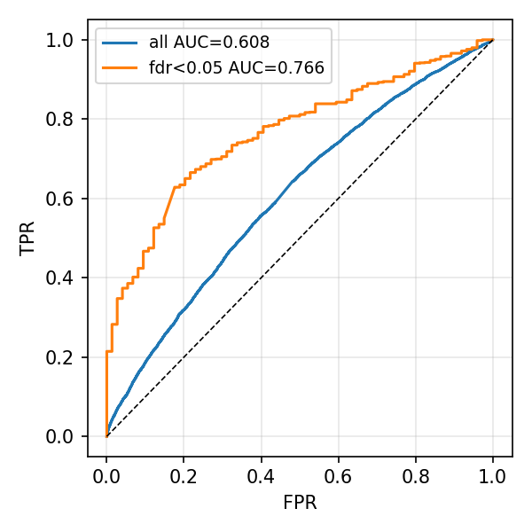<p><strong>ROC направления allelic effect</strong></p><p>Бинарная метка direction: знак <code>comb_es</code> (over vs under), score — предсказание модели. Две кривые: все ~18k строк <code>chr_test.h5</code> и только FDR &lt; 0.05 (~1072 строк).</p><p>На всех данных AUC ≈ 0.61 — чуть лучше случайного, потому что большинство строк — слабый или ненадёжный ASE. На FDR &lt; 0.05 AUC ≈ **0.77**, практически на уровне Random Forest из курсовой (0.763) на той же постановке. Это главная метрика для сравнения с baseline: модель ловит знак там, где биологи доверяют вызову.</p></td>
</tr>
<tr>
<td width="33%" valign="top">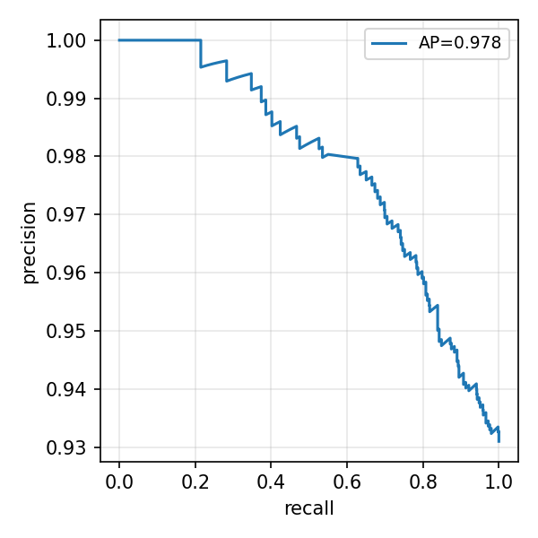<p><strong>PR для direction (FDR &lt; 0.05)</strong></p><p>Precision–recall для задачи over/under только на достоверных ASE-вызовах. Порог режется по непрерывному pred; классы могут быть несбалансированы по знаку.</p><p>Кривая показывает практический компромисс: при высоком recall direction precision падает медленнее, чем у случайного классификатора. Average precision согласуется с AUC ~0.77 на том же subset и дополняет ROC, когда важен operating point для отбора вариантов.</p></td>
<td width="33%" valign="top">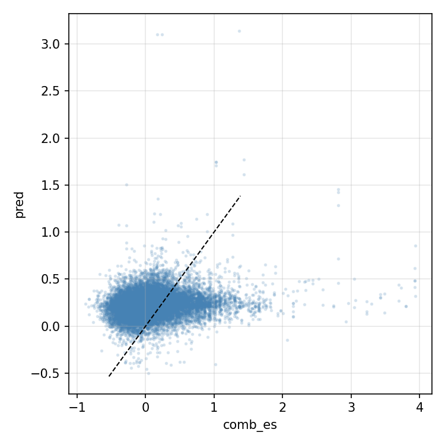<p><strong>Test: все строки</strong></p><p>Scatter истинного <code>comb_es</code> и pred на полном held-out test (18766 записей: вариант × cell type). Pearson r на рисунке ~0.19.</p><p>Низкая корреляция на «all» не противоречит хорошему direction AUC на FDR &lt; 0.05: в long tail попадают нули и шумные effect size, которые последовательность не обязана воспроизводить по модулю. Регрессия по всем строкам — pessimistic estimate; для отчёта важнее subset с FDR &lt; 0.05.</p></td>
<td width="33%" valign="top">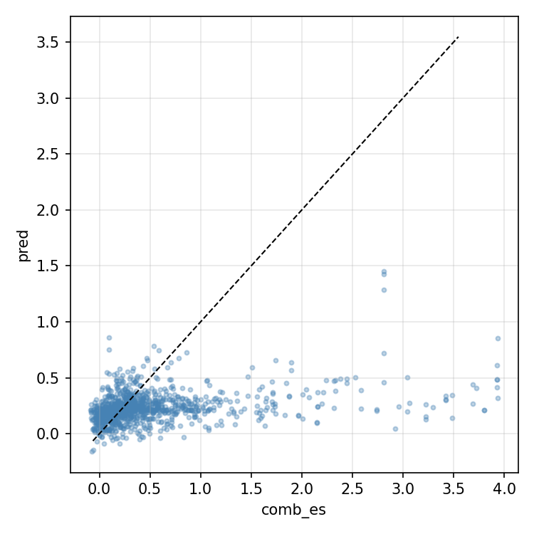<p><strong>Test: только FDR &lt; 0.05</strong></p><p>Тот же scatter, но отфильтрованы строки с <code>fdr_comb_pval</code> &lt; 0.05. Облако компактнее, r ≈ **0.33**.</p><p>Здесь видно, что модель реально регрессирует величину эффекта, когда метка надёжна — не только знак. Остаётся regression to mean (pred сжимают экстремальные comb_es), но направление и порядок величин в целом сохраняются. Именно этот срез ближе к биологической интерпретации «сильных ASE».</p></td>
</tr>
<tr>
<td width="33%" valign="top">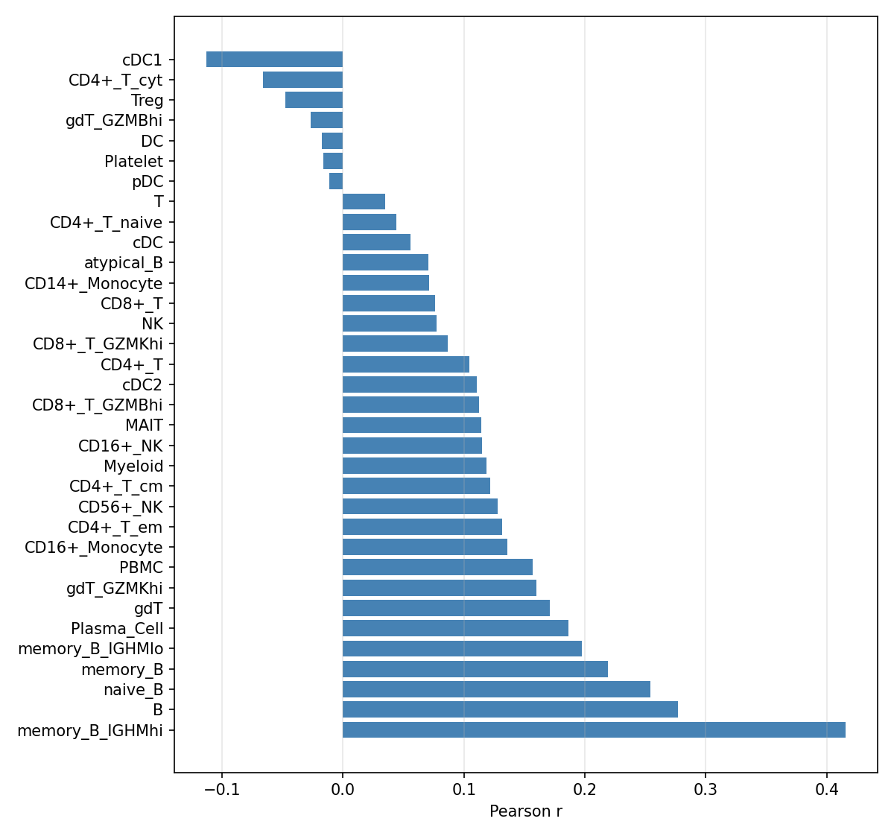<p><strong>Pearson r по типам клеток</strong></p><p>Горизонтальные столбцы: корреляция pred и <code>comb_es</code> на test отдельно для каждого <code>cell_type</code> с n ≥ 10. Подписи — названия из AIDA (B, T, NK, моноциты и т.д.).</p><p>Memory B и naive B часто в верхней части шкалы; редкие T-подтипы скачут из-за малого n — высокий r или провал могут быть дисперсией оценки, а не «плохой биологией». Вывод: одна общая голова + индекс клетки частично учитывает heterogeneity, но не выравнивает все 37 типов.</p></td>
<td width="33%" valign="top">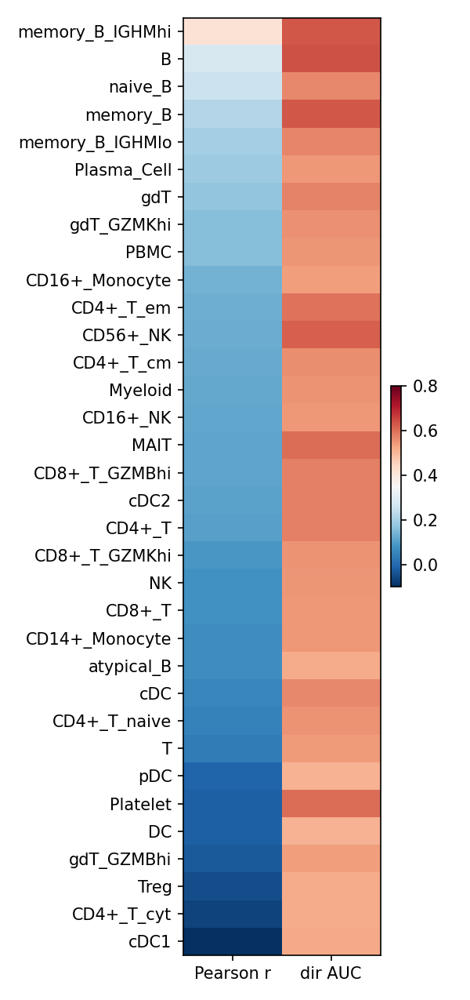<p><strong>Heatmap: r и AUC по клеткам</strong></p><p>Строки — cell types, столбцы — две метрики на test: Pearson r (регрессия comb_es) и AUC direction (знак). Цвет кодирует силу метрики.</p><p>Часто AUC direction остаётся высоким там, где r скромный: модель может верно угадывать over/under при ошибке в модуле effect size. Это типично для seq-only моделей на ASE. Heatmap помогает выбрать клеточные контексты для case study или дообучения per-type головы.</p></td>
<td width="33%" valign="top">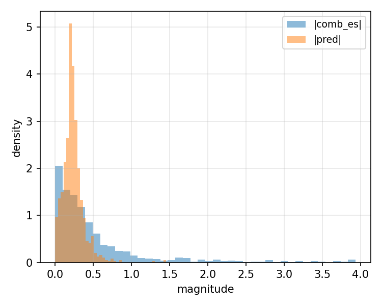<p><strong>Распределение |comb_es| и |pred|</strong></p><p>На FDR &lt; 0.05 наложены density для абсолютного истинного effect size и абсолютного предсказания (log scale или linear — см. ось на PNG).</p><p>Предсказания сжимают хвосты: экстремальные |comb_es| реже повторяются в |pred| — классический regression to mean при Huber и ограниченной ёмкости головы. При этом масштабы согласованы: модель не выдаёт константу. Для ranking вариантов по силе эффекта score всё ещё информативен.</p></td>
</tr>
<tr>
<td width="33%" valign="top">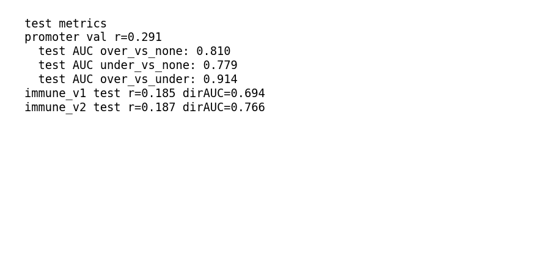<p><strong>Сводка v2</strong></p><p>Текстовая карточка: val/test Pearson, direction AUC (all и FDR &lt; 0.05), размеры выборок — дублирует <code>results_test_metrics.json</code> и таблицу в начале README.</p><p>Используйте для проверки, что пересчёт eval и фигур не разошёлся с документацией. Для защиты/отчёта можно вставить как один слайд «итог v2» рядом с ROC direction.</p></td>
</tr>
</table>

## Графики v1 и выводы (`analysis/`)

<table>
<tr>
<td width="33%" valign="top">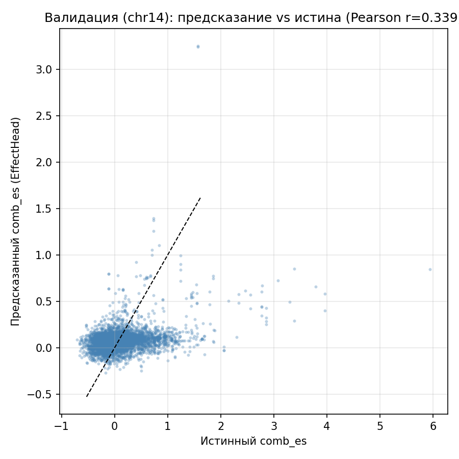<p><strong>Val v1 (chr14)</strong></p><p>Scatter <code>comb_es</code> vs pred для первой версии пайплайна: aux-голова обучалась предсказывать «значимость» (<code>is_sig</code>), без FDR-весов в основном loss.</p><p>Val Pearson по всем строкам чуть выше, чем у v2 (~0.34), но это не аргумент в пользу v1: постановка aux не совпадает с курсовой задачей direction, и модель могла оптимизировать смесь целей. Для production и сравнения с RF используйте v2.</p></td>
<td width="33%" valign="top">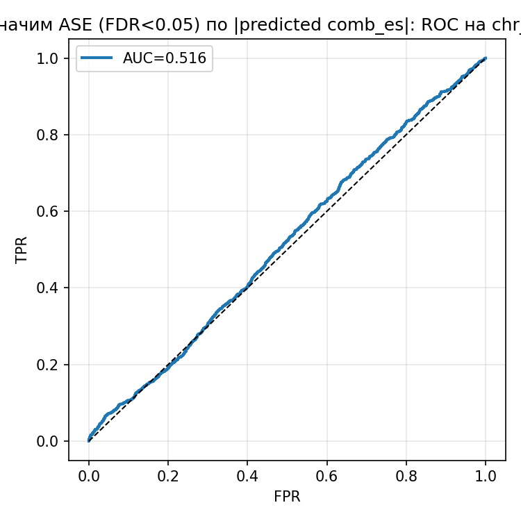<p><strong>ROC «значимости ASE» (v1)</strong></p><p>Бинарная метка: FDR &lt; 0.05; score — модуль pred или связанная величина. Это <em>не</em> direction over/under.</p><p>AUC ≈ 0.52 — почти монетка. FDR зависит от покрытия RNA-seq и числа доноров, а не от локальной ДНК вокруг SNP, поэтому seq-only модель не должна и не может это предсказывать. График полезен как негативный пример: не интерпретировать его как успех пайплайна.</p></td>
<td width="33%" valign="top">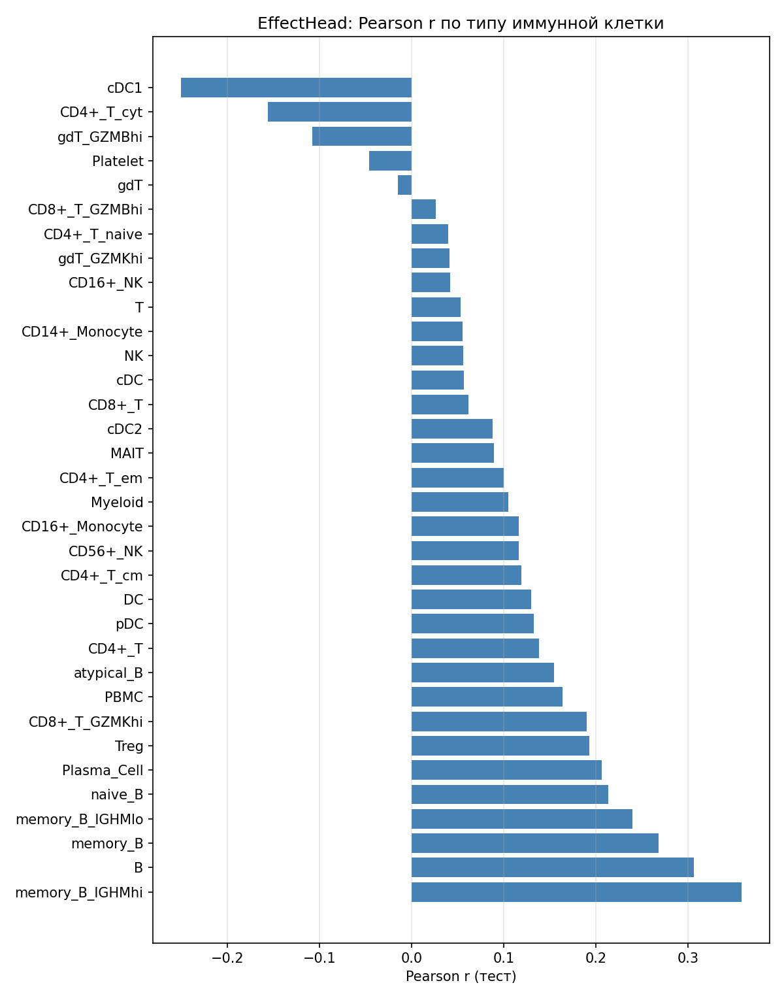<p><strong>Pearson по клеткам (v1)</strong></p><p>Bar plot r на test по <code>cell_type</code> для checkpoint v1 — та же идея, что у v2, но другие веса модели.</p><p>Картина heterogeneity похожа (B vs T, малые n у редких типов), но абсолютные r нельзя напрямую сравнивать с v2 из-за другого loss и aux. Оставлено в репозитории для истории экспериментов.</p></td>
</tr>
</table>

---

## Как работает код (схема)

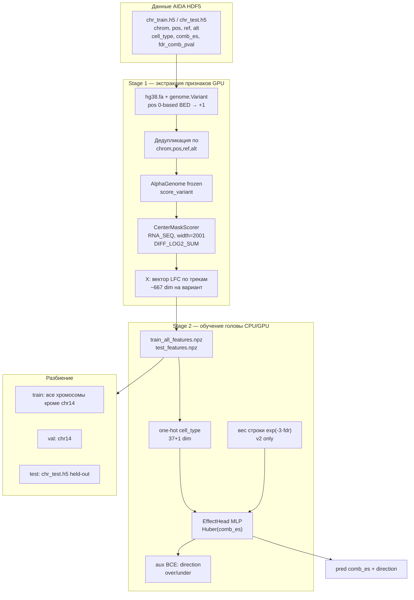
```mermaid
flowchart TB
  subgraph data [Данные AIDA HDF5]
    H5["chr_train.h5 / chr_test.h5\nchrom, pos, ref, alt\ncell_type, comb_es, fdr_comb_pval"]
  end

  subgraph stage1 [Stage 1 — экстракция признаков GPU]
    FASTA["hg38.fa + genome.Variant\npos 0-based BED → +1"]
    DEDUP["Дедупликация по\nchrom,pos,ref,alt"]
    AG["AlphaGenome frozen\nscore_variant"]
    CMS["CenterMaskScorer\nRNA_SEQ, width=2001\nDIFF_LOG2_SUM"]
    X["X: вектор LFC по трекам\n~667 dim на вариант"]
    H5 --> FASTA --> DEDUP --> AG --> CMS --> X
  end

  subgraph stage2 [Stage 2 — обучение головы CPU/GPU]
    CT["one-hot cell_type\n37+1 dim"]
    HEAD["EffectHead MLP\nHuber(comb_es)"]
    AUX["aux BCE: direction\nover/under"]
    W["вес строки exp(-3·fdr)\nv2 only"]
    NPZ["train_all_features.npz\ntest_features.npz"]
    X --> NPZ
    NPZ --> CT --> HEAD
    W --> HEAD
    HEAD --> AUX
  end

  subgraph split [Разбиение]
    TR["train: все хромосомы кроме chr14"]
    VA["val: chr14"]
    TE["test: chr_test.h5 held-out"]
  end

  NPZ --> split
  HEAD --> OUT["pred comb_es + direction"]
```

**Поток данных по файлам:**

| Шаг | Скрипт | Вход | Выход |
|---|---|---|---|
| 1 | `extract_features_immune.py` | HDF5 + FASTA | `features_immune/*_features.npz` |
| 2 | `train_immune_v2.py` | NPZ + vocab JSON | `runs/effect_head_immune_v2/best.pkl` |
| 3 | `evaluate_immune_v2.py` | NPZ + checkpoint | метрики + PNG в `analysis_v2/` |

Опционально (эксперимент, как в курсовой «сырые эмбеддинги»):
`extract_embeddings_immune.py` → признак **3072-dim** =
`mean(embeddings_128bp_alt) − mean(embeddings_128bp_ref)` через
`build_embeddings_apply_fn` в `common.py`.

---

## Принципиальные отличия от старого кода (`AG/905_*`, `AG/1305_*`, `AG/emb_jax_immune.py`)

### 1. Учёт `cell_type` (главная ошибка старых попыток файнтюна)

В HDF5 **один и тот же SNP** (одна последовательность) встречается до **37 раз**
с **разным** `comb_es` — по одному на тип клетки.

| Старый код | Новый код |
|---|---|
| `905_finetune_full_immune.py`, `1305_new_finetune_all_immune.py` **не передают** `cell_type` в модель | `one_hot(cell_type)` **конкатенируется** с LFC-признаками |
| Один X → много разных Y без объяснения → **нерешаемый шум**, val corr **NaN** (см. логи) | Голова учит **разные веса по трекам** для B/T/NK/… |

### 2. Что именно подаётся в голову (сигнал ref vs alt)

| Подход | Признак | Проблема / плюс |
|---|---|---|
| Старый файнтюн: MSE на **средней** разности RNA-seq по окну / 128 bp | Размазанный сигнал SNP | Val ~0, NaN |
| `1305_new_finetune_all_immune.py` | `predict(..., resolutions=(128,))` | **TypeError** — скрипт не доходил до обучения |
| `emb_jax_immune.py` | mean по **всему** окну 128 kb, 667 треков, **без** cell_type в RF-пайплайне на диске | AUC direction на тех же фичах + cell_type ≈ **0.67** (мы перепроверили) |
| **Новый `CenterMaskScorer`** | **log2 sum alt/ref** в **2001 п.н.** вокруг варианта по RNA_SEQ трекам | Локальный ASE-сигнал, как в официальных рекомендациях AlphaGenome |
| Курсовой RF **0.763** | Описаны **сырые внутренние эмбеддинги** (скрипт в репо не сохранился); v2 на LFC **догнал** этот AUC (**0.766**) |

### 3. Обучение backbone vs замороженная модель + маленькая голова

Старые скрипты **размораживали** часть AlphaGenome и оптимизировали MSE end-to-end
на шумных таргетах → нестабильность. Новый пайплайн: **backbone frozen**,
обучается только **`EffectHead`** (~10⁴ параметров) на **кэшированных** признаках —
тот же принцип, что дал успех на PromoterAI (`best_code/`).

### 4. Исправления v2 относительно v1 (без смены признаков)

| v1 | v2 | Эффект |
|---|---|---|
| Равный вес всех строк | **Huber × exp(−3·fdr)** | Меньше шума от маломощных ASE |
| aux BCE на **`is_sig`** (FDR) | aux BCE на **direction** | AUC direction (FDR&lt;0.05): **0.69 → 0.77** |
| early stop по Pearson (all) | то же | Pearson на FDR&lt;0.05: **0.28 → 0.33** |

### 5. Инфраструктура (мелочи, но критичные на практике)

- **Координаты:** `position_start` в HDF5 — 0-based BED → **`+1`** для `genome.Variant`.
- **Дедупликация** вариантов при экстракции (~19843 уникальных вместо 81273 прогонов модели).
- **Val по chr14**, тест — отдельный **`chr_test.h5`** (не та же хромосома).
- **TensorBoard** в `train_immune.py` / `train_immune_v2.py`.
- **`load_alphagenome_model`**: локальный kagglehub-кэш без интерактивного login.

---

## Установка и запуск

Conda-env `ag`, зависимости — `requirements.txt` (как в `best_code/`).

```bash
export CUDA_VISIBLE_DEVICES=0
export FASTA=/path/to/hg38.fa
export CHR_TRAIN=/path/to/chr_train.h5
export CHR_TEST=/path/to/chr_test.h5

chmod +x run_immune_v2.sh
./run_immune_v2.sh
```

Или по шагам:

```bash
python extract_features_immune.py --h5 "$CHR_TRAIN" --split train_all \
  --fasta "$FASTA" --out-dir features_immune
python extract_features_immune.py --h5 "$CHR_TEST" --split test \
  --fasta "$FASTA" --out-dir features_immune \
  --vocab-path features_immune/cell_type_vocab.json

python train_immune_v2.py --features-dir features_immune \
  --out-dir runs/effect_head_immune_v2

python evaluate_immune_v2.py --features-dir features_immune \
  --checkpoint runs/effect_head_immune_v2/best.pkl \
  --plots-dir analysis_v2
```

TensorBoard:

```bash
tensorboard --logdir runs/effect_head_immune_v2/tensorboard --bind_all --port 6006
```

---

## Файлы в этой папке

| Файл | Назначение |
|---|---|
| `extract_features_immune.py` | LFC через `CenterMaskScorer` (основной пайплайн) |
| `extract_embeddings_immune.py` | эксперiment: сырые `embeddings_128bp` diff |
| `train_immune.py` | v1 (baseline, aux=is_sig) |
| `train_immune_v2.py` | **рекомендуемое** обучение |
| `evaluate_immune_v2.py` | метрики + графики direction |
| `evaluate_immune.py` | v1 evaluation |
| `heads.py`, `common.py` | общие модули |
| `run_immune.sh`, `run_immune_v2.sh` | оркестрация |
| `analysis/`, `analysis_v2/` | PNG с результатов прогона на сервере |
| `results_test_metrics.json` | val/test метрики (JSON) |
| `make_figures.py` | train/test figures |
| `report_test_metrics.py` | JSON metrics |
| `checkpoints/effect_head_immune_v*/best.pkl` | обученные чекпоинты (v1 baseline, **v2** основной) |

---

## Связь с `best_code/` (PromoterAI / SNP z-score)

Оба пайплайна используют одну идею: **не** учить backbone с нуля на
усреднённых эмбеддингах, а взять **официальный сигнал ref vs alt**
(`GeneMaskLFCScorer` для генов / `CenterMaskScorer` для ASE без gene_id) и
обучить **`EffectHead`**. Для иммунных данных добавлен обязательный
**`cell_type`**, без которого задача матемatically ill-posed.
