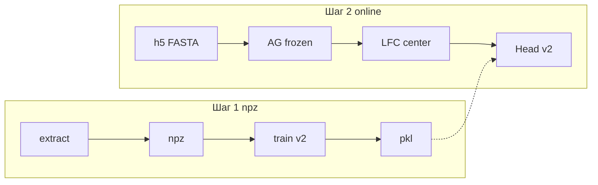
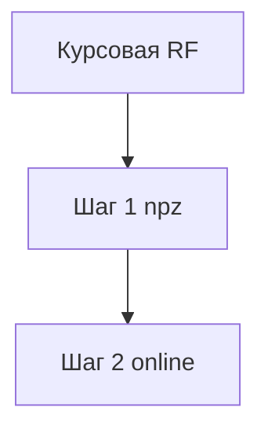
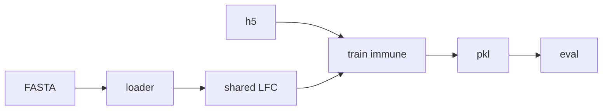
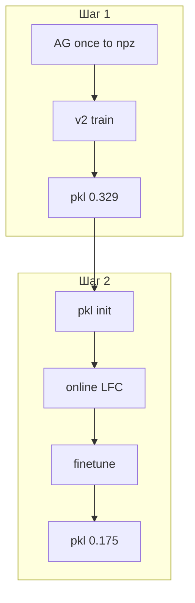

# Иммунные ASE: дообучение головы AlphaGenome с горячим стартом

Предсказание **allele-specific expression (ASE)** по данным AIDA: для пары «SNP + тип иммунной клетки»
модель оценивает **combined effect size** (`comb_es`) и **направление** allelic imbalance (over / under).
AlphaGenome **заморожена** (веса с Kaggle не переучиваются); обучается только **EffectHead v2**.

> **Навигация.** Коротко → результаты и графики → выводы → параметры → **подробный разбор** с формулами.
> Промоторы: [`../finetune_promoter/`](../finetune_promoter/README.md).

## Общая схема каталога `best_finetune`



| Папка | Данные | Признак X |
|-------|--------|-----------|
| [`best_code_immune`](../../best_code_immune/README.md) | `chr_train.h5` | CenterMask LFC + one-hot cell type в npz |
| **finetune_immune** (здесь) | h5 + hg38 | то же, но LFC **на каждом шаге** на GPU |

Общий код: [`../shared/`](../shared/). Запуск: [`../launch_e2e_head_ft.sh`](../launch_e2e_head_ft.sh) `immune` (GPU 0).

---

## Коротко (5 минут)

### Задача

- **Вход:** SNP (chr, pos, ref, alt) + **тип клетки** (37 типов в словаре + слот «unknown»).
- **Таргет обучения:** `comb_es` из MIXALIME; строки с высоким **FDR** вносят **меньший вклад** в Huber-loss.
- **Вспомогательная задача (v2):** предсказать **direction** (over vs under по знаку эффекта) — как в курсовой RF.
- **Val:** все строки **chr14** в `chr_train.h5` (~4497), train — остальные хромосомы (~76776).
- **Test:** `chr_test.h5` (~18 766 строк): Pearson и **direction AUC** (all и FDR &lt; 0.05).

**Критично для понимания:** AlphaGenome **не** запускается отдельно на каждый тип клетки. Один SNP → один
forward ref/alt; **one-hot cell type** говорит MLP, для какой клетки нужен ответ. В батче часто **две строки h5
с одним SNP** — forward **дедуплицируется** ([`e2e_batch_utils.py`](e2e_batch_utils.py)).

### Что было в курсовой и почему не работало

**Веса AlphaGenome (в т.ч. RNA-выходы) в курсовой обычно загружались.** Проблема — **что подавали на обучение сверху**:

| Подход | Суть | Итог |
|--------|------|------|
| Mean **embedding** по широкому окну | ref/alt → mean по ~20 kb → маленькая голова | val r → **0**, «не учится» |
| LoRA backbone + тот же признак | градиент по всей сети | NaN, OOM |
| RF / эмбеддинги с **direction** | сравнение ref/alt в осмысленном представлении | dir AUC **~0.76** на FDR&lt;0.05 |
| v1 aux: предсказать «значим ли ASE» (FDR) | FDR от покрытия, не от ДНК | AUC **~0.52** |

**Чем отличается новый признак от «усреднения по большому окну»:** модель всё ещё смотрит на **16 384 bp** контекста,
но в вектор признаков попадает **CenterMask LFC**: для каждого из ~667 RNA-треков **суммируются** ref и alt
предсказания только в **центральных 2001 bp** вокруг SNP, затем log-ratio alt/ref. Плюс **отдельный one-hot**
типа клетки. Это не `mean(embedding)` по всему окну.

Исправления v2: Huber(`comb_es`) с весами $\exp(-3\cdot\mathrm{FDR})$ + aux на **direction**
([`train_immune_v2.py`](train_immune_v2.py) — тот же loss, что в шаге 2 здесь).

### Два шага



| Узел | Смысл | Val r chr14 |
|------|--------|-------------|
| Курсовая | RF / embeddings, direction | — |
| **Шаг 1** | npz LFC + [`best_code_immune`](../../best_code_immune/README.md) | **0.329** |
| **Шаг 2** | горячий старт, online LFC (эта папка) | 0.171 |

1. **Шаг 1 — холодный старт:** `extract_features_immune.py` → npz; `train_immune_v2.py` → `effect_head_immune_v2/best.pkl`.
   test dir AUC (FDR&lt;0.05) **~0.766**, близко к RF курсовой **~0.763**.
2. **Шаг 2 — горячий старт:** веса MLP из шага 1; scaler и LFC заново на GPU; AG frozen.

### Главный вывод

**Горячий старт не улучшил качество.** Val chr14 **0.171** vs **0.329** у шага 1; direction AUC FDR&lt;0.05 **0.675** vs **0.766**.

| | Val r | Test r all | Test r FDR&lt;0.05 | Dir AUC FDR&lt;0.05 |
|---|--------|------------|---------------------|---------------------|
| **Шаг 1** | **0.329** | **0.187** | **0.331** | **0.766** |
| **Шаг 2** | 0.171 | 0.136 | 0.290 | 0.675 |
| Курсовая RF | — | — | — | **~0.763** |

**Не зря:** доказан сквозной граф «h5 → FASTA → AG → LFC → голова» для immune; для отчёта **берите шаг 1**.
Шаг 2 — задел на дообучение backbone; при batch=2 и online LFC val **шумнее**, чем npz.

---

## Результаты

### Сравнение попыток

| Подход | Val r (chr14) | Test dir AUC FDR&lt;0.05 |
|--------|---------------|---------------------------|
| Курсовая mean embedding | ~0 | — |
| Шаг 1 v1 (aux FDR) | 0.339 all | ~0.52 «sig» — случайно |
| **Шаг 1 v2** ([`best_code_immune`](../../best_code_immune/README.md)) | **0.329** | **0.766** |
| **Шаг 2** (эта папка) | 0.171 | 0.675 |

JSON: [`results_test_metrics.json`](results_test_metrics.json).

### Как шло дообучение (шаг 2)

| Момент | Val r | Комментарий |
|--------|-------|-------------|
| Старт с весами шага 1 | ниже 0.33 | новые μ, σ и online LFC |
| Лучшая эпоха (~46) | **~0.175** | сохранена в `best.pkl` |
| Early stop | ~46 | patience 20 |

Online-пipeline **не догнал** npz-шаг 1; на FDR&lt;0.05 test r (0.29) ближе к шагу 1 (0.33), чем val all.

### Графики

<table>
<tr>
<td width="33%" valign="top"><p><strong>Кривая дообучения</strong></p><p>Train loss = Huber с FDR-весами + 0.5× BCE direction; val Pearson на chr14. Красная точка — лучшая эпоха (~46, r ≈ 0.175).</p><p>Нет «обвала» val r как у embedding-голов курсовой, но плато **ниже** шага 1 (~0.33).</p></td>
<td width="33%" valign="top"><p><strong>Val chr14</strong></p><p>Ось X — `comb_es`, Y — pred; 4497 строк, все cell types; forward через GPU.</p><p>Облако с наклоном, но r ≈ 0.17 — шаг 1 на npz даёт ~0.33 на том же split.</p></td>
<td width="33%" valign="top"><p><strong>ROC direction</strong></p><p>Over vs under; score = pred. Линии: all test и FDR&lt;0.05.</p><p>AUC FDR&lt;0.05 ≈ 0.67 vs 0.77 (шаг 1) и ~0.76 (курсовая RF).</p></td>
</tr>
<tr>
<td width="33%" valign="top"><p><strong>PR direction FDR&lt;0.05</strong></p><p>Precision–recall на надёжных ASE-вызовах; дополняет ROC.</p></td>
<td width="33%" valign="top"><p><strong>Test all</strong></p><p>~18k строк; r ≈ 0.14 (шаг 1 ~0.19). Много шумных меток без FDR cut.</p></td>
<td width="33%" valign="top"><p><strong>Test FDR&lt;0.05</strong></p><p>r ≈ 0.29 — ближе к шагу 1 (0.33), где метки довереннее.</p></td>
</tr>
<tr>
<td width="33%" valign="top"><p><strong>Pearson по cell type</strong></p><p>Качество сильно зависит от типа клетки (n≥10).</p></td>
<td width="33%" valign="top"><p><strong>Heatmap r и AUC</strong></p><p>Иногда direction AUC выше r: знак ловится там, где модуль `comb_es` шумный.</p></td>
<td width="33%" valign="top"><p><strong>|comb_es| vs |pred|</strong></p><p>Сжатие хвостов (regression to mean) — типично для Huber + MLP.</p></td>
</tr>
</table>

### Выводы и интерпретация

1. **Шаг 2 хуже шага 1** на val chr14 — главный численный факт; для диплома опирайтесь на [`best_code_immune`](../../best_code_immune/README.md).
2. **Не «не загрузили RNA»:** AG frozen с полными весами; слабее стало из‑за online LFC, batch=2, пересчёта scaler.
3. **FDR&lt;0.05** — там, где метка надёжна, шаг 2 **ближе** к шагу 1 (r ~0.29 vs 0.33), чем val all.
4. **Direction** остаётся полезной метрикой vs курсовой RF; шаг 2 теряет ~0.09 AUC на FDR&lt;0.05.
5. **Дедуп SNP** — без него VRAM и время explodes; один LFC на вариант, many cell types через one-hot.

---

## Параметры запуска

Из [`../launch_e2e_head_ft.sh`](../launch_e2e_head_ft.sh) (`run_immune`).

| Параметр | Значение |
|----------|----------|
| `--window` | **16384** |
| `--center-width` | **2001** |
| `--batch-size` | **2** |
| `--scaler-batch-size` | **2** |
| `--lr` | **1e-3** |
| `--weight-decay` | **1e-4** |
| `--max-epochs` | **200** |
| `--patience` | **20** |
| `--aux-weight` | **0.5** |
| `--fdr-weight-decay` | **3.0** |
| GPU | `CUDA_VISIBLE_DEVICES=0` |
| JAX | `PREALLOCATE=true`, `MEM_FRACTION=0.88` |

Пути на calc:

| Что | Путь |
|-----|------|
| Warm-start (шаг 1) | `/mnt/calc/homes/d.smirnova/DIPLOM/alphagenome_snp_finetune/runs/effect_head_immune_v2/best.pkl` |
| Train + val chr14 | `/mnt/calc/homes/d.smirnova/DIPLOM/chr_data/chr_train.h5` |
| Test | `/mnt/calc/homes/d.smirnova/DIPLOM/chr_data/chr_test.h5` |
| Vocab cell types | `/mnt/calc/homes/d.smirnova/DIPLOM/alphagenome_snp_finetune/features_immune/cell_type_vocab.json` |
| hg38 | `/mnt/calc/homes/d.smirnova/DIPLOM/AG/hg38.fa` |
| Выход шага 2 | `/mnt/calc/homes/d.smirnova/DIPLOM/alphagenome_snp_finetune/runs/e2e_head_immune_v2/` |

```bash
cd best_finetune && bash launch_e2e_head_ft.sh immune
```

---

## Файлы в этой папке

| Файл | Зачем |
|------|--------|
| `finetune_e2e_head_immune.py` | **Обучение шага 2:** цикл эпох, online LFC, loss v2, горячий старт, early stop |
| `evaluate_e2e_immune.py` | **Оценка** без градиентов: val chr14 + test h5, те же forward что train |
| `immune_sequence_loader.py` | **ДНК:** ref/alt one-hot 16k + **center mask 2001 bp** (без GTF) |
| `e2e_batch_utils.py` | **Экономия GPU:** один AG-forward на SNP в батче; стабилизация grad |
| `extract_features_immune.py` | **Чтение h5** (колонки chrom, pos, cell_type, comb_es, FDR) |
| `train_immune.py` | Baseline v1, Pearson, батчи — для сравнения с v1 |
| `train_immune_v2.py` | **Эталон loss шага 1:** FDR-веса, direction AUC — тот же `compute_loss`, что E2E |

### Карта кода (упрощённая)



| Этап | Файл | Зачем |
|------|------|--------|
| Таблица ASE | `extract_features_immune.py` + h5 | Строки = (SNP × cell type), таргеты и FDR |
| ДНК | `immune_sequence_loader.py` | ref/alt + mask **2001 bp** вокруг SNP |
| Дедуп | `e2e_batch_utils.py` | Один LFC на уникальный SNP в батче |
| AG | [`../shared/common.py`](../shared/common.py) | Загрузка **готовых** весов Kaggle; frozen |
| LFC | [`../shared/e2e_lfc.py`](../shared/e2e_lfc.py) | `compute_rna_lfc_center_mask` |
| Scaler | [`../shared/e2e_scaler.py`](../shared/e2e_scaler.py) | μ, σ LFC по train (без test) |
| Голова | [`../shared/heads.py`](../shared/heads.py) | MLP + Huber + BCE direction |
| Обучение | `finetune_e2e_head_immune.py` | concat(LFC, one-hot cell) → loss v2 |
| Eval | `evaluate_e2e_immune.py` | Метрики для JSON и README |
| Графики | [`../tools/make_figures.py`](../tools/make_figures.py) | PNG (`analysis/` или `analysis_v2/`) |

---

## Подробный разбор

### 1. Почему старый код не учился — и что исправлено

Подробно: [best_code_immune README](../../best_code_immune/README.md). Кратко:

| Было | Стало |
|------|--------|
| mean embedding | CenterMask **LFC** + one-hot cell |
| aux на FDR (v1) | aux на **direction** (v2) |
| LoRA всего AG | frozen AG + MLP ~200k params |
| Признак из npz только offline | npz (шаг 1) **или** online (шаг 2) |

### 2. CenterMask LFC (формулы)

Окно AG: $W = 16384$ bp. Маска $M$: **2001** bp вокруг SNP (выровнена к RNA 1 bp).
Для каждого valid RNA-трека $t$:

$$
S_{\mathrm{ref}}(t) = \sum_{i:\, M_i = 1} \max(R^{\mathrm{ref}}_{i,t}, 0),
\qquad
S_{\mathrm{alt}}(t) = \sum_{i:\, M_i = 1} \max(R^{\mathrm{alt}}_{i,t}, 0)
$$

$$
\mathrm{LFC}(t) = \ln(S_{\mathrm{alt}}(t) + \varepsilon) - \ln(S_{\mathrm{ref}}(t) + \varepsilon),
\quad \varepsilon = 10^{-3}
$$

Нормировка по train (как у promoter):

$$
\tilde{x}_t = \min\left(50,\, \max\left(-50,\, \frac{x_t - \mu_t}{\sigma_t}\right)\right)
$$

**Вход MLP:** конкатенация $\tilde{\mathbf{LFC}}$ и one-hot типа клетки (37 + 1 unknown).
Размерность = число valid RNA-треков + число cell types + 1.

### 3. Loss v2

$$
w_i = \max\left(0.05,\, \exp(-3 \cdot \mathrm{FDR}_i)\right)
$$

$$
L_z = \frac{\sum_i w_i \, H(\hat{z}_i - z_i)}{\sum_i w_i}
$$

где $z_i$ — **comb_es**, а $H$ — Huber с $\delta=1$ (как в [`../shared/heads.py`](../shared/heads.py)).

$$
L_{\mathrm{aux}} = \mathrm{BCE}(\mathrm{logit}_{\mathrm{over}},\, y_i^{\mathrm{dir}}),
\qquad
L = L_z + 0.5\, L_{\mathrm{aux}}
$$

Обновляются **только** веса EffectHead; `backbone` в оптимизатор не попадает.

### 4. Холодный vs горячий старт



Test h5 **не** участвует в scaler, warm-start и выборе эпохи.

### 5. Путь одной строки h5


### 6. Отличия от promoter

| | Promoter | Immune |
|---|----------|--------|
| Данные | CSV + GTF | h5 |
| Маска | GeneMask экзоны | Center 2001 bp |
| Вход MLP | только LFC | LFC + cell type |
| Loss | Huber(z) | Huber + FDR weights + direction |
| batch | 8 | 2 |

### 7. Что пробовалось

| Попытка | Итог |
|---------|------|
| v1 aux FDR | AUC ~0.5 |
| **v2 direction** (шаг 1) | **лучший** |
| Шаг 2 online | val ↓, pipeline OK |
| LoRA immune | нестабильно |

### 8. Ограничения

- AG **не** fine-tune; «дообучение» = только MLP.
- **Медленно:** ~77k train rows, batch 2, 2× forward на step.
- `make_figures --e2e` повторяет eval forward.
- PNG в README: после launch скопируйте из `analysis_v2/` в `analysis/` при необходимости.
