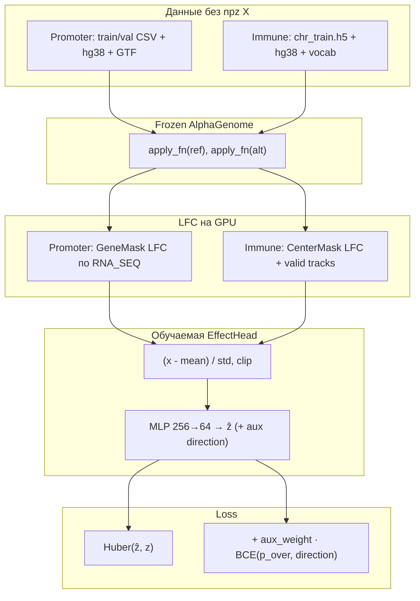

# E2E fine-tune EffectHead (Stage 2.5): frozen AlphaGenome + онлайн LFC

Папка **`best_finetune`** — код **сквозного дообучения только головы** (`EffectHead`), когда
признаки **не читаются из npz**, а **считаются на GPU на каждом шаге** из ref/alt
последовательностей через **замороженный** AlphaGenome.

Это логическое продолжение **`best_code`** / **`best_code_immune`** (Stage 2 на npz), а не
замена: те же архитектура головы и loss, другой **путь получения входа X**.

---

## Короткий ответ: warm-start весов головы — это читерство?

**Нет.** Это обычная **двухстадийная** (или transfer) постановка в ML:

| Стадия | Что заморожено | Что учится | Данные |
|--------|----------------|------------|--------|
| **Stage 2** (`best_code`) | AlphaGenome | только EffectHead | LFC из `extract_features*.py` → npz |
| **E2E здесь** | AlphaGenome | только EffectHead | CSV/H5 + FASTA, LFC **онлайн** |

**`--head-checkpoint`** подставляет **только веса MLP** из Stage 2 (`effect_head_v1` /
`effect_head_immune_v2`). Backbone **не** подглядывает в test; test **не** участвует в
обучении. Scaler LFC по умолчанию **пересчитывается** на train (флаг
`--init-scaler-from-checkpoint` — осознанный откат к старому scaler).

Почему это **корректно**:

1. Stage 2 уже учит голову предсказывать **тот же таргет z** из **того же смысла
   признаков** (GeneMask / CenterMask LFC), только offline.
2. E2E **уточняет** голову под **численно близкий, но не идентичный** online-forward
   (другой порядок батчей, JAX-граф, иногда другая агрегация) — как **fine-tune** после
   pretrain на кэше.
3. В публикации честно писать: *«голова инициализирована обучением на offline LFC;
   затем дообучена end-to-end при frozen backbone»* — это **не** leakage labels с test.

Warm-start **не обязателен**: можно стартовать с random init — дольше и нестабильнее.
Warm-start **не даёт** доступа к ответам test — только к весам, уже полученным на train/val
Stage 2.

---

## Схема пайплайна



**Promoter:** одна строка CSV ≈ один SNP + ген + таргет `z`.  
**Immune:** строка h5 = SNP + **тип клетки** + `z`; LFC от пары ref/alt **общий** для SNP,
к голове **добавляется one-hot типа клетки** (голова знает, для какой клетки предсказание).

---

## Что считается на каждом шаге

### 1. Последовательности

- **Promoter:** `PromoterSequenceLoader` — окно 16 kb, gene mask из GTF.
- **Immune:** `ImmuneSequenceLoader` — окно 16 kb, center mask 2001 bp.

### 2. Forward (frozen)

Два вызова `apply_fn` на one-hot ref и alt → предсказания **RNA_SEQ** (1 bp resolution).

### 3. LFC (дифференцируемый JAX, см. `e2e_lfc.py`)

- **Promoter:** как `GeneMaskLFC` / `extract_features.py` — log-ratio по маске гена.
- **Immune:** как `extract_features_immune.py` — center mask, только валидные треки
  (`get_rna_seq_valid_mask`).

Вектор LFC **нормируется** scaler'ом, fit **один раз** на train (`e2e_scaler.py`:
проход по train батчами через тот же LFC).

### 4. EffectHead (`heads.py`)

Вход: `[scaled_LFC (+ one-hot cell_type для immune)]` → MLP → **ẑ** и опционально logit
**p_over** (направление up/down).

### 5. Loss

Общий для Stage 2 и E2E (`compute_loss`):

- **Основной:** Huber loss между **ẑ** и таргетом **z** (robust regression).
- **Immune v2 aux:** `aux_weight` (default 0.5) × **BCE** по бинарному **direction**
  (over vs under); на train — **веса строк** от FDR (`fdr_to_weight`), как в
  `train_immune_v2.py`.

Promoter в E2E: aux отключён по сути ( `p_over` = NaN, только Huber по `z` ).

### 6. Оптимизация

- Обновляются **только** параметры EffectHead (`optax.adamw`).
- Early stopping по **val Pearson r** (promoter) / **val Pearson** (immune chr14).
- TensorBoard: train loss, val r, immune — dir AUC, r по FDR, по top cell types.

---

## Отличие от `best_code` на GitHub (Stage 2)

| | **best_code / best_code_immune** | **best_finetune (E2E)** |
|---|----------------------------------|-------------------------|
| Вход X | Готовый npz после `extract_features*.py` | LFC каждый step из ref/alt |
| AlphaGenome на train | Один раз offline (extract) | Каждый step (frozen) |
| seq_cache / npz X в train | Да (Stage 2) | **Нет** |
| Скорость | Быстро (минуты–часы) | Медленно (часы–дни) |
| Eval test | `evaluate.py` на npz X | `evaluate_e2e_*.py` — тот же forward |
| Warm-start | — | опционально Stage 2 `best.pkl` |

**Цель E2E:** та же постановка задачи, но **без рассинхрона** «npz построен иначе, чем
граф обучения» и с возможностью позже стыковать Stage 3 (LoRA backbone) на **одном** JAX-графе.

Ориентиры качества Stage 2 (не гарантия побития на test):

| Задача | Метрика (Stage 2, см. `best_code/results_test_metrics.json`) |
|--------|----------------------------------------------------------------|
| Promoter val | Pearson r ≈ **0.29** |
| Promoter test | AUC over/none ≈ **0.81** |
| Immune val chr14 | Pearson r ≈ **0.33** |
| Immune test | Pearson all ≈ **0.19**, dir AUC FDR&lt;0.05 ≈ **0.77** |

После E2E метрики пишутся в `results_eval/test_metrics_e2e.json` (скрипт launch).

---

## Отличие от курсового кода, который «не учился»

В корне репозитория лежат старые папки (`linear_head_*`, `lora_*`, `head_tracks_*`, …).
Типичные проблемы (подробнее в `best_code/README.md`):

1. **Усреднение эмбеддингов** по всему окну — SNP-сигнал размывается, val r **деградирует**.
2. **LoRA на весь backbone** без стабильного LFC-пути — шум / OOM.
3. **RF на LFC** — рабочая классификация, но **не** end-to-end модель.

**best_code** исправил Stage 2: LFC (GeneMask / CenterMask) + EffectHead.  
**best_finetune** переносит **тот же loss и голову** в режим **online LFC**, без
обходного npz в training loop.

---

## Файлы в папке

| Файл | Назначение |
|------|------------|
| `finetune_e2e_head_promoter.py` | Обучение promoter E2E |
| `finetune_e2e_head_immune.py` | Обучение immune E2E (loss v2) |
| `evaluate_e2e_promoter.py` | Val/test через forward |
| `evaluate_e2e_immune.py` | Val chr14 + test h5 через forward |
| `e2e_lfc.py` | GeneMask / CenterMask LFC в JAX |
| `e2e_scaler.py` | Fit mean/std LFC на train |
| `promoter_sequence_loader.py` / `immune_sequence_loader.py` | FASTA, маски |
| `common.py` | Загрузка AG, apply_fn, valid mask |
| `heads.py` | EffectHead + `compute_loss` |
| `train.py`, `train_immune*.py` | Батчи, метрики, FDR weights (immune) |
| `extract_features_immune.py` | `_load_h5` для immune |
| `e2e_batch_utils.py` | Дедуп SNP в батче (immune) |
| `launch_e2e_head_ft.sh` | GPU 3 promoter + GPU 0 immune, eval, figures |
| `make_figures.py` | PNG + флаг `--e2e` |
| `report_test_metrics.py` | Сводка JSON |

---

## Запуск

Пути к данным заданы в **`launch_e2e_head_ft.sh`** (FASTA, CSV, h5, чекпоинты Stage 2).
На машине с GPU и conda env `ag`:

```bash
cd best_finetune
# unset JAX_PLATFORMS если мешает GPU
bash launch_e2e_head_ft.sh both    # promoter + immune параллельно
# bash launch_e2e_head_ft.sh promoter
# bash launch_e2e_head_ft.sh immune
```

Логи: `runs/e2e_head_*_v*.log`, чекпоинты: `runs/e2e_head_*_v*/best.pkl`.

**Batch:** promoter 8, immune 2 (immune тяжелее по VRAM — длиннее LFC + one-hot клеток).
При OOM уменьшите `IMMUNE_BATCH` / `PROMOTER_BATCH` в launch.

---

## Связь стадий (для отчёта / статьи)

```text
Stage 1  extract_features*.py     offline LFC → npz
Stage 2  train.py / train_immune_v2.py   EffectHead на npz  → effect_head_*/best.pkl
Stage 2.5  best_finetune (этот код)   frozen AG + online LFC + EffectHead (+ warm-start)
Stage 3  finetune_lora_* (опционально)   LoRA последних блоков RNA + голова
```

Stage 2.5 **не подменяет** Stage 2 в отчёте: это **уточнение** при том же frozen backbone и
тех же таргетах, с **прозрачным** eval без npz X.
