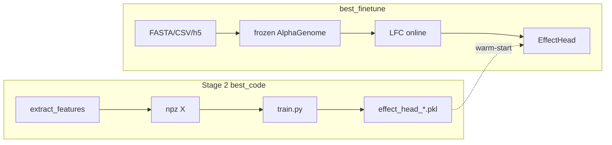

# best_finetune — E2E дообучение EffectHead (Stage 2.5)

Здесь лежит **сквозное** дообучение **только головы** при **замороженном** AlphaGenome:
на каждом шаге ref/alt → forward → LFC → scaler → MLP → loss. **Без** `features/*_features.npz`
и **без** `seq_cache` в training loop.

Структура репозитория:

| Папка | Содержание |
|-------|------------|
| [`shared/`](shared/) | Общий код: `common.py`, `heads.py`, `e2e_lfc.py`, `e2e_scaler.py`, eval-хелперы для графиков |
| [`finetune_promoter/`](finetune_promoter/) | PromoterAI: CSV + FASTA + GTF, GeneMask LFC |
| [`finetune_immune/`](finetune_immune/) | Immune ASE: chr_train.h5 + FASTA, CenterMask LFC, loss v2 |
| [`tools/`](tools/) | `make_figures.py`, `report_test_metrics.py` |
| [`launch_e2e_head_ft.sh`](launch_e2e_head_ft.sh) | Один скрипт: обучение + eval + PNG |

**Подробные объяснения, формулы и сравнение со старыми подходами** — в README каждой задачи:

- [finetune_promoter/README.md](finetune_promoter/README.md)
- [finetune_immune/README.md](finetune_immune/README.md)

## Связь со Stage 2 на GitHub

| Стадия | Папка на GitHub | Что учится |
|--------|-----------------|------------|
| Stage 2 offline | `best_code`, `best_code_immune` | EffectHead на npz LFC |
| **Stage 2.5 E2E** | **`best_finetune`** | EffectHead на **online** LFC |

Warm-start (`--head-checkpoint`) — **только веса MLP** из Stage 2; это не подглядывание в test
(см. раздел «инициализация» в README promoter/immune).

## Запуск (как на calc)

```bash
cd best_finetune
bash launch_e2e_head_ft.sh both    # GPU 0 immune + GPU 3 promoter
```

Логи и чекпoинты: `best_finetune/runs/`. Пути к FASTA/CSV/h5 и Stage-2 `.pkl` — в начале
`launch_e2e_head_ft.sh` (блок `DATA_ROOT`).

## Параметры запуска (фиксированные в launch)

Общее для обоих: `window=16384`, `lr=1e-3`, `max_epochs=200` (early stop раньше),
`XLA_PYTHON_CLIENT_PREALLOCATE=true`, `MEM_FRACTION=0.88`, warm-start Stage 2.

| | Promoter | Immune |
|---|----------|--------|
| GPU | **3** | **0** |
| train batch | **8** | **2** |
| scaler batch | **8** | **2** |
| val batch | **16** | = train |
| patience | **15** | **20** |
| aux / FDR | только Huber по `z` | Huber + **aux_weight=0.5**, FDR-веса |
| center mask | — | **2001** bp |
| Данные | `train/val_variants1.csv` | `chr_train.h5`, val chr**14** |

Immune batch меньше не «по теории», а из‑за VRAM (длиннее LFC + one-hot типа клетки).

## Схема (общая)


