# Иммунные ASE: дообучение головы AlphaGenome

Предсказание **allele-specific expression (ASE)** по данным AIDA: для пары «SNP + тип иммунной клетки»
модель оценивает **combined effect size** (`comb_es`) 
 
## Общая схема 

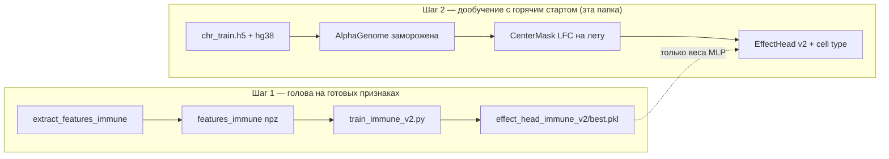

Общие модули: [`../shared/`](../shared/). Запуск: [`../launch_e2e_head_ft.sh`](../launch_e2e_head_ft.sh) `immune` (GPU 0).

---
 
### Задача

- **Вход:** SNP (chr, pos, ref, alt) и **тип клетки** (37 типов + unknown в one-hot).
- **Обучение:** регрессия на **`comb_es`** (MIXALIME); строки с большим FDR получают **меньший вес** в loss.
- **Дополнительно:** вспомогательная голова предсказывает **направление** эффекта (over vs under) — как в курсовой RF на эмбеддингах.
- **Валидация:** все строки с **chr14** в `chr_train.h5` (~4497), не пересекается с train по хромосоме.
- **Тест:** `chr_test.h5` (~18 766 строк), метрики Pearson и **direction AUC** (в т.ч. только FDR &lt; 0.05).

### Что было в курсовой и почему не работало

Подробный разбор — в [README шага 1](../../best_code_immune/README.md) и в [best_code (промоторы)](../../best_code/README.md). Кратко для immune:

| Проблема | Где в курсовой / ранних попытках | Следствие |
|----------|----------------------------------|-----------|
| Усреднение **сырых эмбеддингов** по всему окну | mean-embedding головы | val r → 0, «не учится» |
| LoRA на весь backbone без стабильного признака | `lora_*` | NaN, OOM, ранняя остановка |
| Aux-голова на «значим ли ASE» (`is_sig` / FDR) | `train_immune.py` v1 | AUC ~0.52 — случайность (FDR не закодирован в ДНК) |
| **Работало:** RF на LFC / эмбеддингах | курсовая | direction AUC **~0.763** на FDR &lt; 0.05 |

**Исправление:** признак = **CenterMask LFC** (сумма RNA ref/alt в окне **2001 bp** вокруг SNP) + **one-hot cell type**;
loss v2 = Huber(`comb_es`) с весами `exp(-3·FDR)` + BCE по **direction** ([`train_immune_v2.py`](train_immune_v2.py)).

### Два шага (холодный и горячий старт)

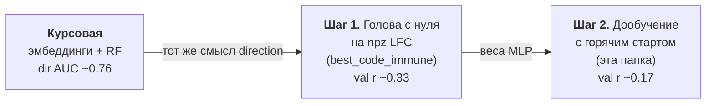

1. **Шаг 1 — обучение головы с нуля на заранее посчитанных признаках**
   ([`best_code_immune`](../../best_code_immune/README.md)): `extract_features_immune.py` → npz,
   `train_immune_v2.py` → `runs/effect_head_immune_v2/best.pkl`, val Pearson **~0.329**, test dir AUC FDR&lt;0.05 **~0.766**.
2. **Шаг 2 — дообучение с горячим стартом (эта папка):** те же веса головы как старт, но LFC считается
   **на каждом шаге** через frozen AlphaGenome (без npz). AlphaGenome **не меняется**.

### Главный вывод

**Горячий старт не улучшил качество — на val он заметно хуже шага 1.**

| | Val Pearson r (chr14) | Test r (all) | Test r (FDR&lt;0.05) | Dir AUC (FDR&lt;0.05) |
|---|----------------------|--------------|----------------------|------------------------|
| **Шаг 1** ([`best_code_immune`](../../best_code_immune/README.md)) | **0.329** | **0.187** | **0.331** | **0.766** |
| **Шаг 2** (эта папка) | 0.171 | 0.136 | 0.290 | 0.675 |
| Курсовая RF (ориентир) | — | — | — | **~0.763** |

**Не зря:** шаг 2 подтвердил, что тот же loss v2 и та же архитектура работают **сквозным графом** на GPU
(последовательность → AG → LFC → голова). Для отчёта и сравнения с курсовой **лучше оставить шаг 1**.
Шаг 2 нужен как мост к будущему дообучению весов AlphaGenome, но при frozen backbone и batch=2
online-LFC **шумнее и медленнее**, чем npz.

---

## Результаты

### Сравнение попыток

| Подход | Val r (chr14) | Test dir AUC FDR&lt;0.05 | Комментарий |
|--------|---------------|---------------------------|-------------|
| Курсовая: mean embedding | ~0 | — | сигнал размыт |
| Шаг 1 v1 aux на FDR | 0.339 (all) | ~0.52 AUC «sig» | aux бессмысленен |
| **Шаг 1 v2** ([`best_code_immune`](../../best_code_immune/README.md)) | **0.329** | **0.766** | **рекомендуемая модель** |
| **Шаг 2 горячий старт** (эта папка) | 0.171 | 0.675 | хуже npz, пайплайн валиден |

JSON: [`results_test_metrics.json`](results_test_metrics.json). Early stop шага 2 ~эпоха **46**, best train-val r ≈ **0.175**.

### Графики

> PNG генерируются `make_figures.py --e2e` в `analysis/` (или `analysis_v2/` при launch — скопируйте в `analysis/` для README).

<table>
<tr>
<td width="33%" valign="top">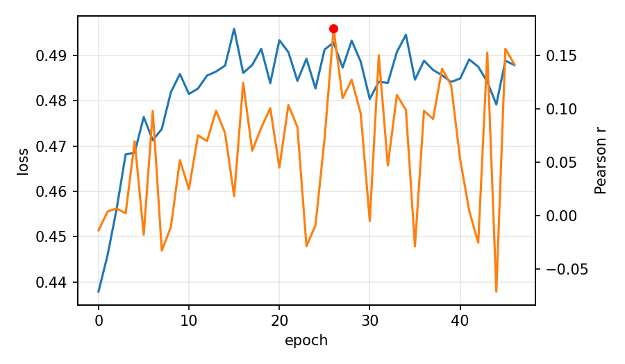<p><strong>Кривая дообучения (шаг 2)</strong></p><p>Синяя — train loss (Huber + FDR-веса + direction aux), оранжевая — val Pearson на chr14. Красная точка — лучшая эпоха (~46, r ≈ 0.175).</p><p>Плато ниже шага 1 (~0.33): online LFC и batch=2 дают шумный val; обвала как в курсовых embedding-головах нет.</p></td>
<td width="33%" valign="top">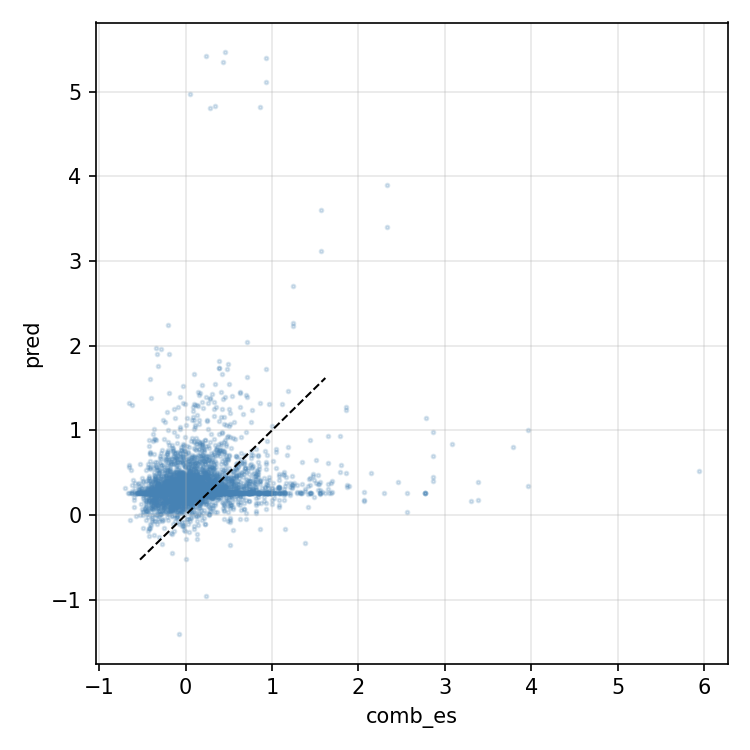<p><strong>Val chr14: comb_es vs pred</strong></p><p>4497 строк, все cell types; предсказание через GPU-forward, не npz.</p><p>r ≈ 0.17 — слабее шага 1 (~0.33), но наклон «больше effect → выше pred» сохраняется.</p></td>
<td width="33%" valign="top">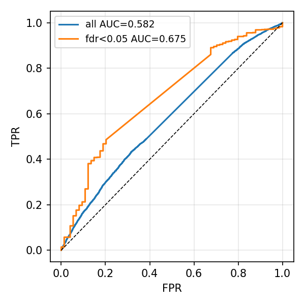<p><strong>ROC direction на test</strong></p><p>Over vs under, score = pred. Кривые: все строки и FDR &lt; 0.05.</p><p>AUC FDR&lt;0.05 ≈ 0.67 vs 0.77 у шага 1 и ~0.76 у курсовой RF — знак ловится, но слабее.</p></td>
</tr>
<tr>
<td width="33%" valign="top">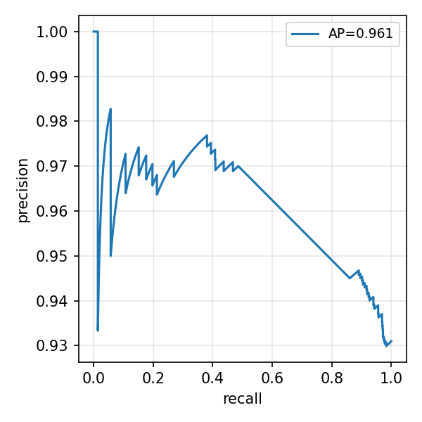<p><strong>Precision–recall (FDR &lt; 0.05)</strong></p><p>Дополнение к ROC для редких positive по direction.</p></td>
<td width="33%" valign="top">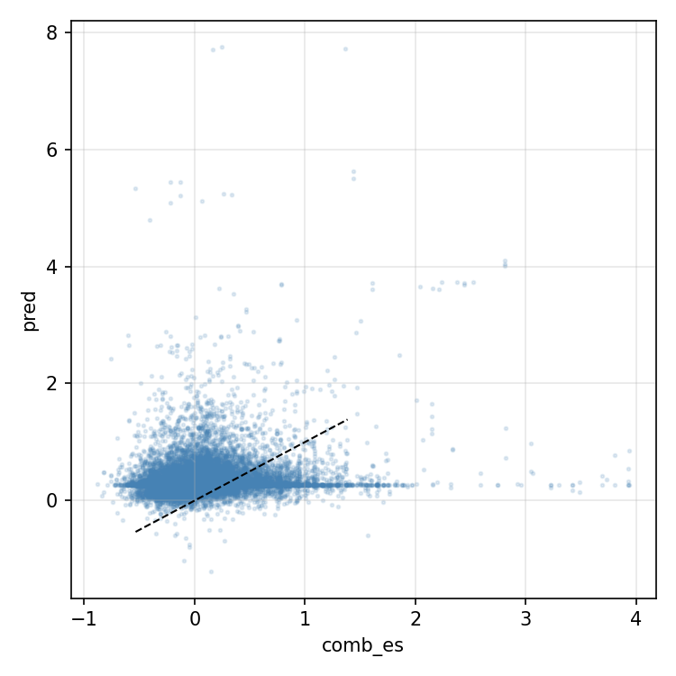<p><strong>Test scatter (all)</strong></p><p>~18k строк; r ≈ 0.14 (шаг 1 ~0.19).</p></td>
<td width="33%" valign="top">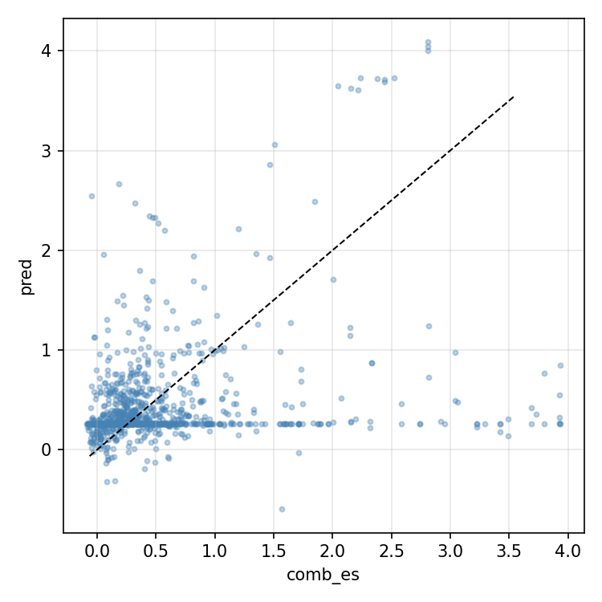<p><strong>Test FDR &lt; 0.05</strong></p><p>r ≈ 0.29 — ближе к шагу 1 (0.33), где метки надёжнее.</p></td>
</tr>
<tr>
<td width="33%" valign="top">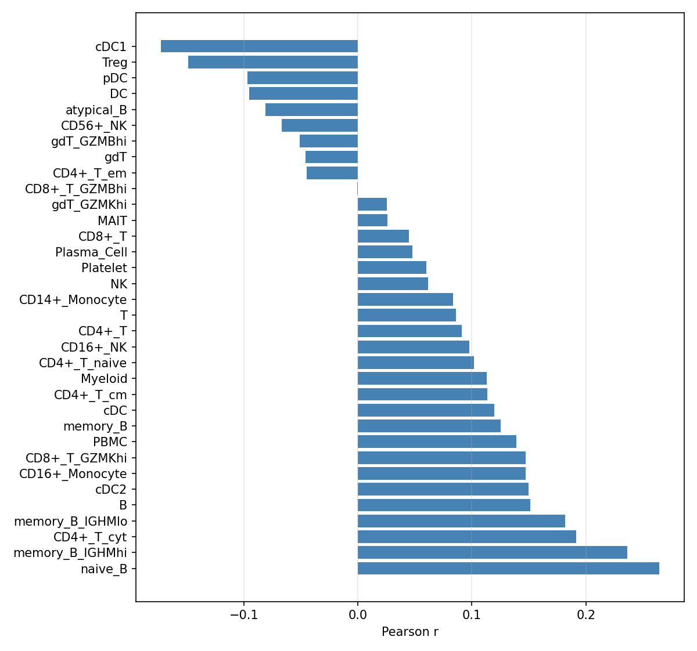<p><strong>Pearson по типу клетки</strong></p><p>Разброс качества по 37 типам (n ≥ 10).</p></td>
<td width="33%" valign="top">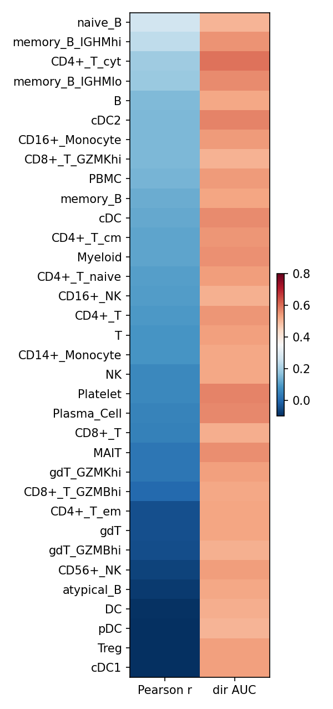<p><strong>Heatmap r и dir AUC</strong></p><p>Две метрики по cell types на test.</p></td>
<td width="33%" valign="top">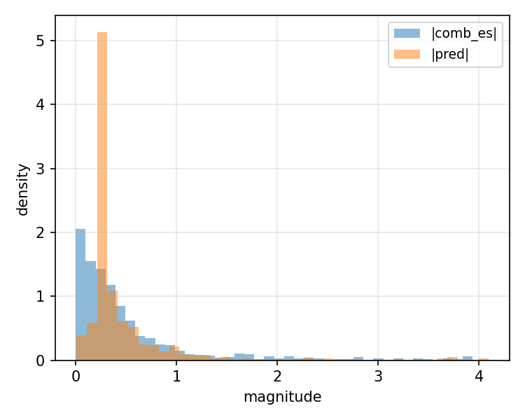<p><strong>|comb_es| vs |pred|</strong></p><p>Сжатие хвостов (regression to mean), как у Huber + MLP на шаге 1.</p></td>
</tr>
</table>

### Выводы и интерпретация

1. **Шаг 2 хуже шага 1**, особенно val chr14 (0.17 vs 0.33). Основные причины: **online LFC** (численно близко к npz, но не идентично), **batch=2**, долгий scaler-fit на ~77k строк.
2. **На FDR &lt; 0.05** регрессия шага 2 (r ≈ 0.29) **ближе** к шагу 1 (0.33), чем val all — модель полезнее там, где метка доверена.
3. **Direction AUC** на FDR&lt;0.05 (0.67) ниже курсового RF и шага 1 (~0.76), но **выше случайного** — direction aux не бесполезен, но online-пipeline ослабил fit.
4. **Дедуп SNP в батче** обязателен: один forward AG на (chr,pos,ref,alt), many строк h5 с разными cell types → one-hot выбирает «для кого» ответ.
5. **Для диплома/отчёта:** цифры шага 1 + сравнение с RF; шаг 2 — как инженерная проверка E2E и задел на разморозку backbone.

---

## Параметры запуска

Как в [`../launch_e2e_head_ft.sh`](../launch_e2e_head_ft.sh) (`run_immune`).

| Параметр | Значение |
|----------|----------|
| `--window` | **16384** |
| `--center-width` | **2001** (в коде loader по умолчанию) |
| `--batch-size` | **2** |
| `--scaler-batch-size` | **2** |
| `--lr` | **1e-3** |
| `--weight-decay` | **1e-4** |
| `--max-epochs` | **200** |
| `--patience` | **20** |
| `--aux-weight` | **0.5** |
| `--fdr-weight-decay` | **3.0** |
| `--seed` | **42** |
| GPU | `CUDA_VISIBLE_DEVICES=0` |
| JAX VRAM | `XLA_PYTHON_CLIENT_PREALLOCATE=true`, `MEM_FRACTION=0.88` |

Пути на calc:

| Что | Путь |
|-----|------|
| Warm-start (шаг 1) | `runs/effect_head_immune_v2/best.pkl` → `/mnt/calc/homes/d.smirnova/DIPLOM/alphagenome_snp_finetune/runs/effect_head_immune_v2/best.pkl` |
| Train / val split | `/mnt/calc/homes/d.smirnova/DIPLOM/chr_data/chr_train.h5` (~81k строк; train ~76776, val chr14 ~4497) |
| Test | `/mnt/calc/homes/d.smirnova/DIPLOM/chr_data/chr_test.h5` (~18766 строк) |
| Словарь cell types | `/mnt/calc/homes/d.smirnova/DIPLOM/alphagenome_snp_finetune/features_immune/cell_type_vocab.json` |
| Геном | `/mnt/calc/homes/d.smirnova/DIPLOM/AG/hg38.fa` |
| Результат шага 2 | `/mnt/calc/homes/d.smirnova/DIPLOM/alphagenome_snp_finetune/runs/e2e_head_immune_v2/` |

```bash
cd best_finetune
bash launch_e2e_head_ft.sh immune
```

---

## Файлы в этой папке

| Файл | Роль |
|------|------|
| `finetune_e2e_head_immune.py` | Обучение (шаг 2, горячий старт) |
| `evaluate_e2e_immune.py` | Val Pearson + test метрики (online forward) |
| `immune_sequence_loader.py` | FASTA, center mask 2001 bp |
| `e2e_batch_utils.py` | Дедуп SNP в батче, обнуление non-finite grad |
| `extract_features_immune.py` | Чтение h5 (`_load_h5`) |
| `train_immune.py` | Батчи, Pearson; baseline v1 |
| `train_immune_v2.py` | FDR-веса, direction AUC — **тот же loss**, что в шаге 2 |

Общие зависимости:

| Файл | Роль |
|------|------|
| [`../shared/common.py`](../shared/common.py) | Загрузка AlphaGenome, координаты SNP |
| [`../shared/e2e_lfc.py`](../shared/e2e_lfc.py) | `compute_rna_lfc_center_mask` |
| [`../shared/e2e_scaler.py`](../shared/e2e_scaler.py) | μ, σ LFC по train |
| [`../shared/heads.py`](../shared/heads.py) | EffectHead v2 + Huber + BCE aux |
| [`../tools/make_figures.py`](../tools/make_figures.py) | PNG в `analysis/` |

### Карта кода

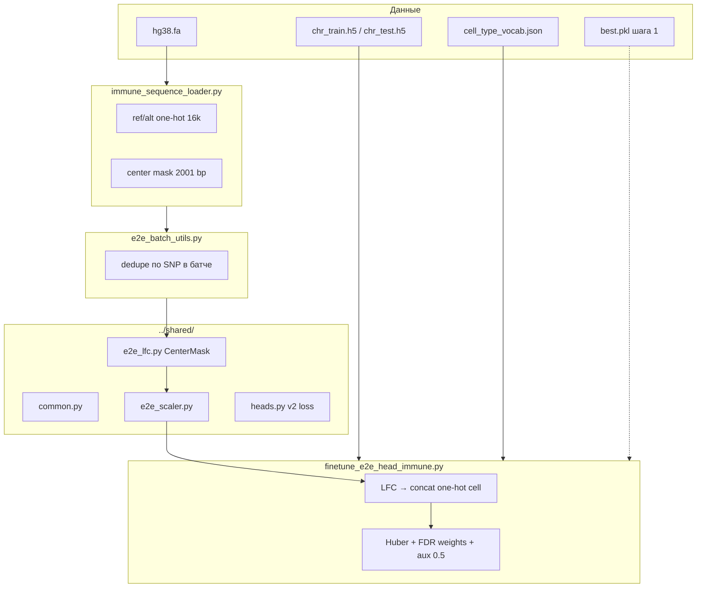

---

## Подробный разбор

### 1. Почему старый код не учился (immune)

См. [best_code_immune README](../../best_code_immune/README.md): v1 aux на «значимость ASE» даёт AUC ~0.5,
потому что **FDR зависит от покрытия**, а не от последовательности. v2 переключил aux на **direction**
(знак `comb_es`) — как курсовая RF.

### 2. CenterMask LFC (формулы)

Окно AG: $W = 16384$ bp. **Center mask** $M$: $2001$ bp вокруг SNP (выровнено к оси предсказаний RNA 1 bp).
Для каждого RNA-трека $t$ (только valid tracks, их $N_{\mathrm{tracks}}$):

$$
S_{\mathrm{ref}}(t) = \sum_{i:\, M_i = 1} \max(R^{\mathrm{ref}}_{i,t}, 0),
\qquad
S_{\mathrm{alt}}(t) = \sum_{i:\, M_i = 1} \max(R^{\mathrm{alt}}_{i,t}, 0)
$$

$$
\mathrm{LFC}(t) = \ln(S_{\mathrm{alt}}(t) + \varepsilon) - \ln(S_{\mathrm{ref}}(t) + \varepsilon),
\quad \varepsilon = 10^{-3}
$$

После — sanitize (NaN→0, clip $\pm 20$), затем стандартизация по train:

$$
\tilde{x}_t = \mathrm{clip}\left(\frac{x_t - \mu_t}{\sigma_t}, -50, 50\right)
$$

**Вход MLP:**

$$
\mathbf{x} = \big[\, \tilde{\mathbf{LFC}} \,\|\, \mathrm{onehot}(\mathrm{celltype}) \,\big],
\qquad
\dim(\mathbf{x}) = N_{\mathrm{tracks}} + N_{\mathrm{celltypes}} + 1
$$

(last slot — unknown cell type).

### 3. Loss v2 (как [`train_immune_v2.py`](train_immune_v2.py))

Вес строки по FDR:

$$
w_i = \max\left(0.05,\; \exp(-3 \cdot \mathrm{FDR}_i)\right)
$$

$$
L_z = \frac{\sum_i w_i \,\mathrm{Huber}(\hat{z}_i - z_i)}{\sum_i w_i}
$$

Здесь $z_i$ — таргет **comb_es** из h5 (combined effect size).

Direction (over если $z > 0$ по конвенции курсовой — см. код):

$$
L_{\mathrm{aux}} = \mathrm{BCEWithLogits}(\mathrm{logit}_{\mathrm{over}},\; \mathbb{1}[\mathrm{direction}=\mathrm{over}])
$$

$$
L = L_z + 0.5 \cdot L_{\mathrm{aux}}
$$

Градиент обновляет **только веса головы**; `backbone` AlphaGenome frozen.

### 4. Холодный vs горячий старт

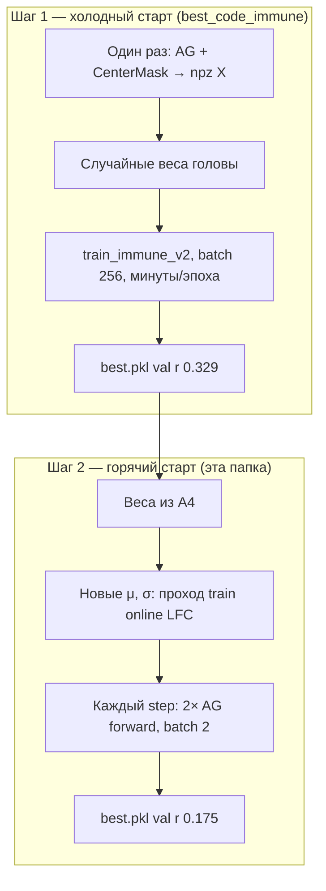

Test **не** участвует в scaler, весах warm-start (только train h5) и выборе эпохи.

### 5. Тонкости

- **Дедуп:** в батче 2 строки с одним SNP и разными cell types → один LFC, два one-hot → два $\hat{z}$.
- **Val chr14:** тот же протокол, что шаг 1 — сравнимо, но online LFC даёт другой шум.
- **Immune vs promoter:** promoter — GeneMask + gene в GTF; здесь — center window, без GTF ([сравнение](../finetune_promoter/README.md)).
- **Ограничения:** медленно; `make_figures --e2e` дублирует forward; batch=2 из VRAM.

### 6. Что пробовалось

| Попытка | Итог |
|---------|------|
| v1 aux на FDR / is_sig | AUC ~0.5, не для отчёта |
| **v2 direction aux** ([шаг 1](../../best_code_immune/README.md)) | **лучший результат** |
| **Горячий старт online (эта папка)** | val ↓, E2E pipeline OK |
| LoRA + frozen head (не в этой папке) | нестабильно на immune |
