# Промоторные варианты: дообучение головы AlphaGenome с горячим стартом

---
## Общая схема 

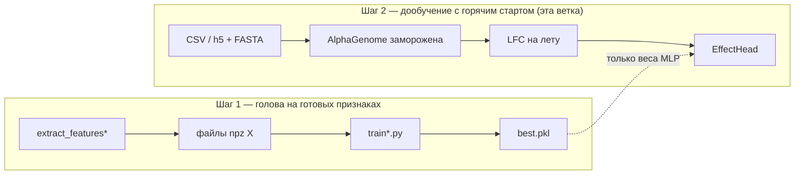

### Что было до и почему не работало

Пытались дообучать модель «напрямую» через скрытые слои: извлекали внутренние представления (эмбеддинги) бэкбона AlphaGenome по всему окну в 20 000 п.н., усредняли их по длине последовательности (Mean Pooling) и обучали поверх линейный слой. Из-за ошибочной конфигурации (`num_tracks=1`) предобученная РНК-голова AlphaGenome на 667 треков полностью игнорировалась и заменялась случайными весами. 

Этот подход страдал от двух критических проблем:
1. **Размытие сигнала (Signal Dilution):** Точечная мутация (SNP) меняет эмбеддинги трансформера лишь локально. При глобальном усреднении по 20 000 позициям полезный сигнал мутации математически растворялся в неизменившемся контексте ДНК. Линейная голова получала на вход шум, быстро переобучалась (оверфиттинг) под обучающую выборку, из-за чего корреляция Пирсона на валидации сначала поднималась до 0.16–0.20, а затем деградировала до 0.09–0.15.
2. **Проблемы с LoRA:** Попытки адаптировать сам бэкбон через LoRA приводили к расходимости градиентов или к нехватке видеопамяти (OOM).

### Что изменено

Вместо извлечения абстрактных сырых эмбеддингов бэкбона, мы задействовали предобученные биологические знания AlphaGenome, обратившись к её родной РНК-голове (667 эпигенетических треков) и перейдя к вычислению эффекта мутации (Log-Fold-Change).

1. **Шаг 1 — Обучение головы с нуля на готовых признаках** ([код и README: `best_code`](../../best_code/README.md)).  
   AlphaGenome полностью заморожена. Для каждого SNP мы запускаем оригинальную модель в режиме инференса отдельно для референсного (`ref`) и альтернативного (`alt`) аллелей. На выходе родной РНК-голова вычисляет профили экспрессии для 667 типов клеток и тканей (с внутренним агрегированием по экзонам гена). Мы рассчитываем разность предсказаний в логарифмической шкале — **Log-Fold-Change (LFC)**. Полученный вектор из 667 биологически осмысленных чисел сохраняется на диск. Полносвязная MLP-нейросеть глубокой архитектуры (667 → 256 → 64 → 1) обучается по этим признакам предсказывать z-score. Благодаря этому корреляция Пирсона совершила рывок до **0.291**.
2. **Шаг 2 — Дообучение с горячим стартом (эта папка).**  
   Проводим fine-tuning с «горячим стартом» (warm-start), инициализируя веса нашей MLP-головы значениями, полученными на Шаге 1. Бэкбон AlphaGenome заморожен и выступает в роли экстрактора признаков (feature extractor), поэтому градиенты обновляют веса только обучаемой MLP-головы.

### Главный вывод

**Качество превзошло прошлые попытки, но дообучение не дало лучше метрик, чем просто обучение MLP на выделенных признаках.** На валидации r = **0.285** против **0.291** у шага 1, AUC на тесте
ниже на 0.01–0.03. Лучшая модель для промоторов — по-прежнему [шаг 1](../../best_code/README.md).

Но:

- обе версии **в 1.5–3 раза лучше** курсовых голов по корреляции;
  по AUC обе на уровне или выше Random Forest из курсовой;
- шаг 2 доказал, что весь путь «последовательность → AlphaGenome → признаки → голова» работает и воспроизводит результат шага 1.  

---

## Результаты

### Сравнение всех попыток

| Подход | Val Pearson r | AUC over / none | AUC under / none | AUC over / under |
|---|---|---|---|---|
| Курсовая: линейные головы на усреднённых эмбеддингах ([`linear_head_masked`](../../linear_head_masked/), [`head_mean`](../../head_mean/), [`head_tracks_*`](../../bad_proba/)) | 0.16–0.20 → **падает** до 0.09–0.15 | — | — | — |
| Курсовая: LoRA на весь backbone ([`lora_1`](../../lora_1/), [`bad_proba/lora_128`](../../bad_proba/lora_128/)) | −0.02…0.08 (шум) / нехватка памяти | — | — | — |
| Курсовая: Random Forest на LFC (3 запуска) | не считался | 0.73–0.78 | 0.75–0.78 | 0.86–0.90 |
| **Шаг 1:** MLP с нуля на выделенных признаках ([`best_code`](../../best_code/README.md)) | **0.291** | **0.810** | **0.779** | **0.914** |
| **Шаг 2:** дообучение с горячим стартом (эта папка) | 0.285 | 0.783 | 0.768 | 0.902 |

Размеры выборок: валидация 2044 варианта, тест 749. Сводка в JSON: [`results_test_metrics.json`](results_test_metrics.json).

### Графики

<table>
<tr>
<td width="33%" valign="top">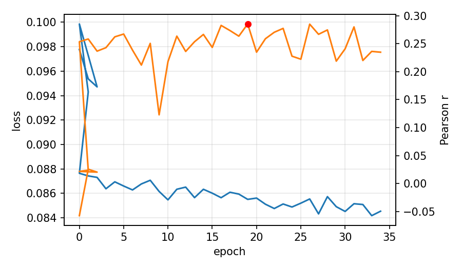
<strong>Кривая дообучения</strong>

Синяя линия — ошибка на обучении (Huber), оранжевая — корреляция Пирсона на валидации, красная точка — лучшая эпоха (19, r ≈ 0.285).
</td>
<td width="33%" valign="top">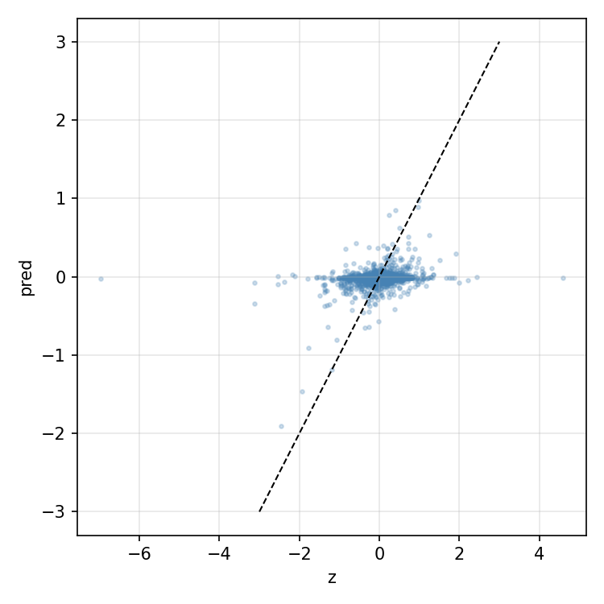
<strong>Валидация: истина и предсказание</strong>

Точка — один SNP: по X истинный <code>z</code>, по Y предсказание. 

 r ≈ 0.29
</td>
<td width="33%" valign="top">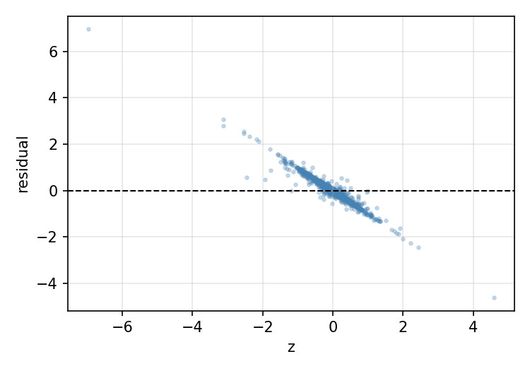
<strong>Ошибки на валидации</strong>

По Y — предсказание минус истина.

Точки лежат вдоль линии с наклоном почти −1: предсказания по модулю намного меньше истинных z, и ошибка растёт с |z|. r ≈ 0.29
</td>
</tr>
<tr>
<td width="33%" valign="top">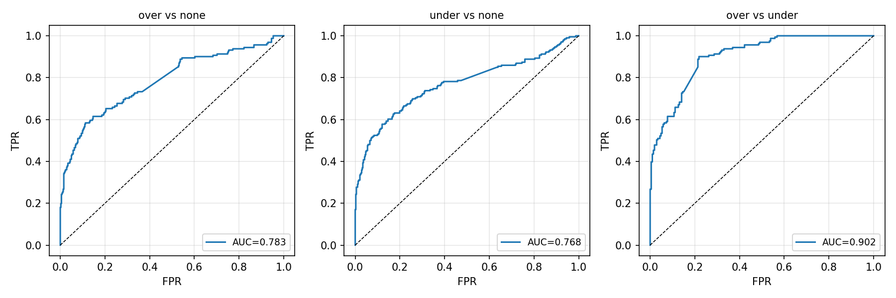
<strong>ROC на тесте</strong>

<code>tableS1A</code>, три пары классов; оценка — предсказанное число.

AUC 0.78 / 0.77 / 0.90 — чуть ниже шага 1 (0.81 / 0.78 / 0.91), тот же уровень. Лучше всего разводятся over и under — модель уверенно различает знак эффекта.
</td>
<td width="33%" valign="top">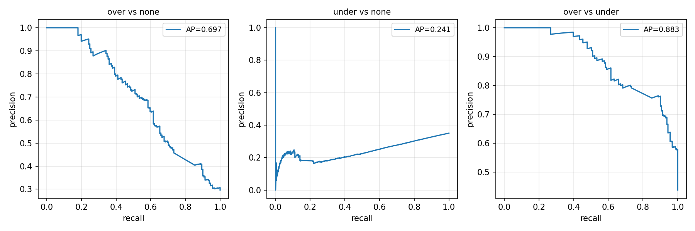
<strong>Precision–recall на тесте</strong>

Те же три пары, но в координатах точность–полнота.
</td>
<td width="33%" valign="top">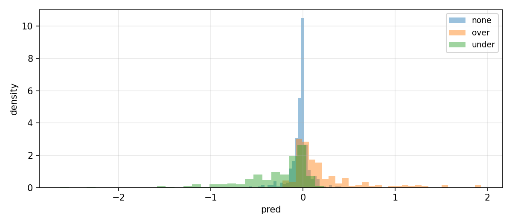
<strong>Распределение предсказаний по классам</strong>

Гистограммы предсказанного числа отдельно для none, over, under.

none — около нуля, over сдвинут вправо, under — влево. 
</td>
</tr>
<tr>
<td width="33%" valign="top">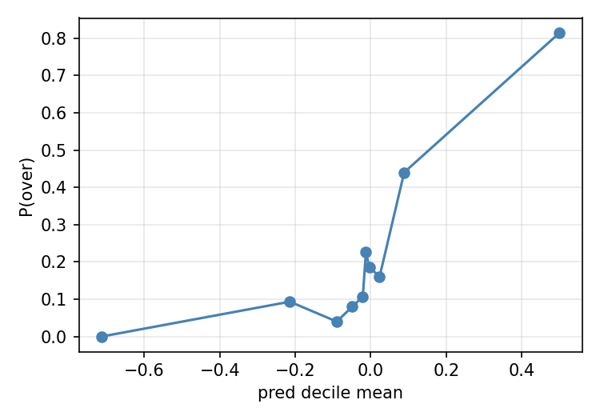
<strong>Калибровка для over</strong>

Тест разбит на 10 равных групп по предсказанию; по Y — доля over в группе.

Чем выше предсказание, тем чаще over: число можно читать как «уверенность в повышении экспрессии».
</td>
<td width="33%" valign="top">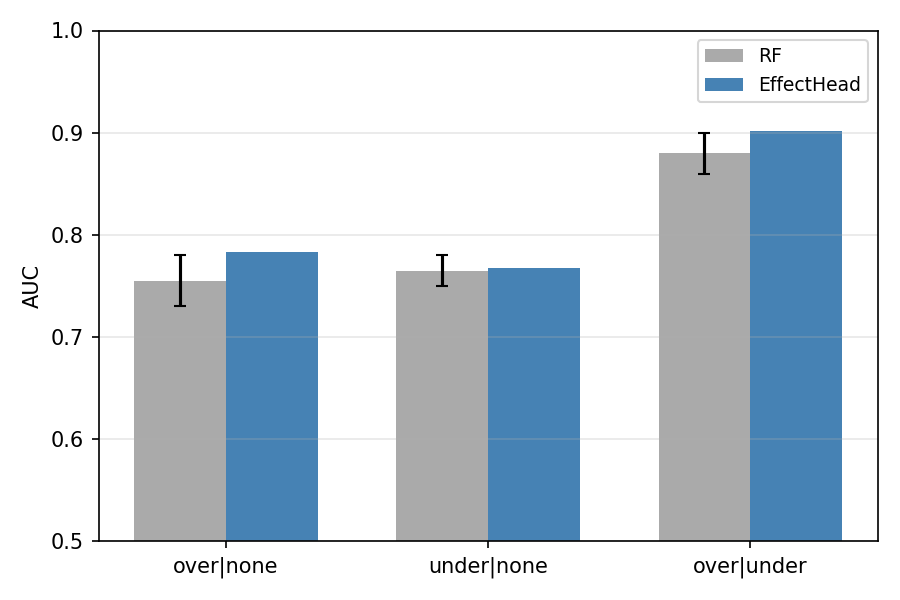
<strong>Сравнение с Random Forest</strong>

Серые столбцы — RF из курсовой, синие — голова после дообучения.

Голова на уровне RF по всем трём парам, а по over/under выше его верхней границы.
</td>
<td width="33%" valign="top">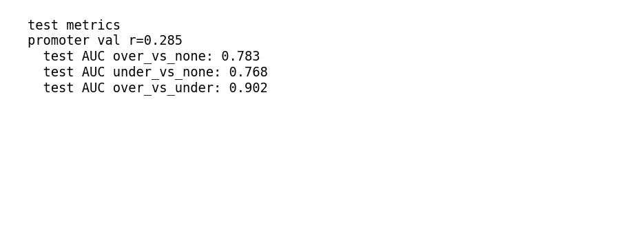
<strong>Сводка чисел</strong>

Val r и три AUC из <code>results_test_metrics.json</code>.
</td>
</tr>
</table>

### Выводы и интерпретация

1. **Улучшения от finetune нет.** AlphaGenome заморожена, значит в признаке та же информация,
   что и на шаге 1. Голова уже была обучена до своего потолка, поэтому дообучение может лишь
   подстроить её под слегка изменившиеся признаки (окно 16 384 вместо 131 072 п.н.), но не выйти выше. 
2. **По сравнению с курсовой - скачок.** Корреляция выше в 1.5–3 раза и не падает
   со временем; по классификации голова сравнялась с Random Forest или превзошла его.
3. **Валидация шумная.** Между соседними эпохами r скачет от 0.12 до 0.285. Лучшую эпоху выбирали по
   валидации, поэтому 0.285 — слегка оптимистичная оценка. Тест (AUC) в выборе не участвовал и честен.
4. **Для роста качества хочется расширить окно:** вернуть большое окно (131 072 п.н.) или разморозить небольшую часть AlphaGenome (например, последний слой RNA-выхода). 

---

## Параметры запуска

Значения из [`../launch_e2e_head_ft.sh`](../launch_e2e_head_ft.sh), с которыми получены результаты выше.

| Параметр | Значение |
|---|---|
| `--window` | **16384** |
| `--batch-size` | **8** |
| `--val-batch-size` | **16** |
| `--scaler-batch-size` | **8** |
| `--lr` | **1e-3** |
| `--weight-decay` | **1e-4**   |
| `--max-epochs` | **200** |
| `--patience` | **15** |
| `--seed` | **42**  | 

Пути к данным на сервере calc:

| Что | Путь |
|---|---|
| Warm-start | `runs/effect_head_v1/best.pkl` (шаг 1) → `/mnt/calc/homes/d.smirnova/DIPLOM/alphagenome_snp_finetune/runs/effect_head_v1/best.pkl` |
| Train CSV | `train_variants1.csv` → `/mnt/calc/homes/d.smirnova/DIPLOM/AG/data/train_variants1.csv` (32 072 строки; по логу фильтр по маске гена прошли все 32 072) |
| Val CSV | `val_variants1.csv` → `/mnt/calc/homes/d.smirnova/DIPLOM/AG/data/val_variants1.csv` (2044 строки) |
| Test | `tableS1A.tsv` → `/mnt/calc/homes/d.smirnova/DIPLOM/AG/data/tableS1A.tsv` (749 вариантов с известным классом) |
| Геном | `/mnt/calc/homes/d.smirnova/DIPLOM/AG/hg38.fa` |
| Аннотация генов | `/mnt/calc/homes/d.smirnova/DIPLOM/alphagenome_snp_finetune/gencode.v39.feather` (GENCODE v39, готовится [`prepare_gtf.py`](../../best_code/prepare_gtf.py)) |
| Веса AlphaGenome | не в репозитории; локальный кэш kagglehub `~/.cache/kagglehub/models/google/alphagenome/jax/all_folds/` |
| Результат обучения | `/mnt/calc/homes/d.smirnova/DIPLOM/alphagenome_snp_finetune/runs/e2e_head_promoter_v1/` (`best.pkl`, `lfc_scaler.npz`, `tensorboard/`) |

 
---

## Файлы в этой папке

| Файл | Роль |
|------|------|
| `finetune_e2e_head_promoter.py` | Обучение |
| `evaluate_e2e_promoter.py` | Val Pearson + test AUC |
| `promoter_sequence_loader.py` | FASTA, GTF, gene mask |
| `train.py` | `make_batches`, `pearson_r` |

Общие файлы, которые использует эта папка:

| Файл | Роль |
|------|------|
| [`../shared/common.py`](../shared/common.py) | Загрузка AlphaGenome, координаты SNP, список валидных RNA-треков |
| [`../shared/e2e_lfc.py`](../shared/e2e_lfc.py) | Подсчёт LFC внутри графа JAX (`compute_rna_lfc_gene_mask`) |
| [`../shared/e2e_scaler.py`](../shared/e2e_scaler.py) | Среднее и разброс LFC по обучающей выборке |
| [`../shared/heads.py`](../shared/heads.py) | Голова (MLP) и функция ошибки Huber |
| [`../shared/evaluate.py`](../shared/evaluate.py) | AUC по парам классов, как в курсовом Random Forest |
| [`../tools/make_figures.py`](../tools/make_figures.py) | Все графики из папки `analysis/` |
| [`../launch_e2e_head_ft.sh`](../launch_e2e_head_ft.sh) | Запуск: обучение → оценка → графики |

### Карта кода: какой файл что делает

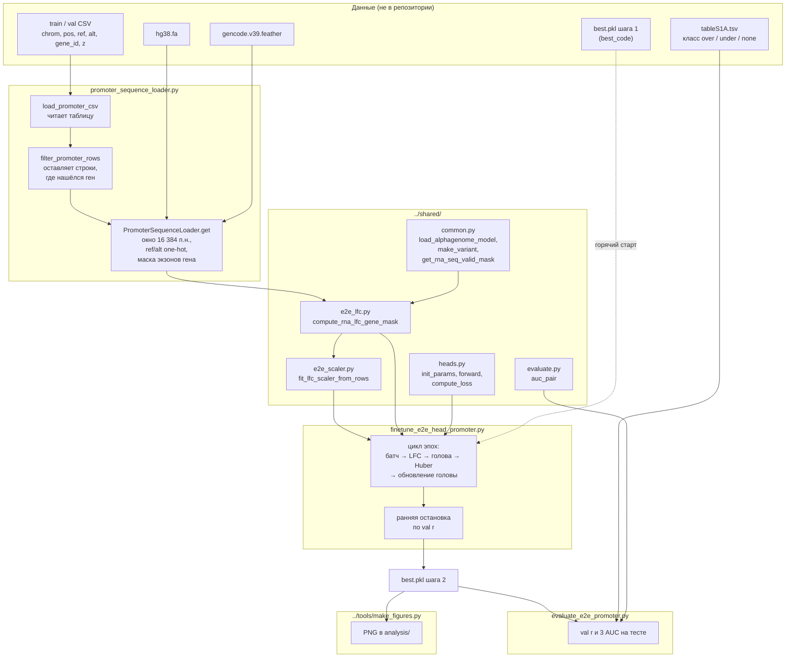

---

## Подробный разбор: как всё работает и что исправлено

### 1. Почему код курсовой не обучался

Подробно — в [README шага 1](../../best_code/README.md) (раздел «Почему старый код не обучался»); здесь главное.

| Проблема в курсовой | Где | Что происходило |
|---|---|---|
| Усреднение внутренних эмбеддингов по всему окну 20 480 п.н. | [`head_mean`](../../head_mean/), [`linear_head_masked`](../../linear_head_masked/), [`linear_head_not_masked`](../../linear_head_not_masked/) | Сигнал одной замены «растворяется» в среднем по 20 000 позиций. Ошибка на обучении падала, корреляция на валидации — тоже: модель запоминала шум |
| 128/970 выходных треков усредняются в одно число в функции ошибки | [`bad_proba/head_tracks_128`](../../bad_proba/head_tracks_128/), [`head_tracks_970`](../../bad_proba/head_tracks_970/) | Разные биологические сигналы складывались в один — переобучение без обобщения |
| LoRA на весь backbone, шаг 5e-4–1e-3 без разогрева | [`lora_1`](../../lora_1/), [`bad_proba/lora_128`](../../bad_proba/lora_128/) | Ошибка улетала в тысячи или не хватало памяти GPU |
| Функция ошибки вида `mean(predictions) * 0.0` в части голов | LoRA-головы | Градиент всегда ноль |
| Ручная вырезка из FASTA без проверки ref | `data_loader.py` | Риск сдвига на 1 п.н. (0- и 1-based координаты) |

Что работало в курсовой — Random Forest — использовал не эмбеддинги, а **уже готовые предсказания
RNA-экспрессии** AlphaGenome, сравнённые для ref и alt внутри гена. Новый код берёт **именно этот признак**,
но учит на нём нейросеть.

### 2. Что исправлено в новом коде

| Было | Стало | Где в коде |
|---|---|---|
| Среднее эмбеддингов по окну | LFC предсказанной RNA ref против alt **внутри экзонов гена**, по каждому из 667 треков отдельно | `../shared/e2e_lfc.py`, официальная функция `gene_mask._score_gene_variant` |
| Учили backbone (LoRA) | AlphaGenome заморожена, учится только голова (~190 тыс. параметров) | `finetune_e2e_head_promoter.py`: оптимизатор получает только веса головы |
| Линейный слой | MLP 667 → 256 → 64 → 1, ReLU, dropout 0.2 | `../shared/heads.py` |
| MSE | Huber (устойчив к редким огромным z) | `../shared/heads.py::huber_loss` |
| Признаки без нормировки | Стандартизация по обучающей выборке | `../shared/e2e_scaler.py` |
| Сохранение после каждой эпохи | Сохраняется эпоха с лучшим val r, ранняя остановка | `finetune_e2e_head_promoter.py` |
| Ручные координаты | Официальные `genome.Variant` / `genome.Interval` (1-based, как в VCF) | `../shared/common.py::make_variant` |
| ID генов `ENSG….10` в GTF не совпадали с `ENSG…` в CSV | Версия отрезается перед сравнением | `../shared/common.py::strip_ensembl_version` |

### 3. Шаг 1 и шаг 2: как устроены холодный и горячий старт

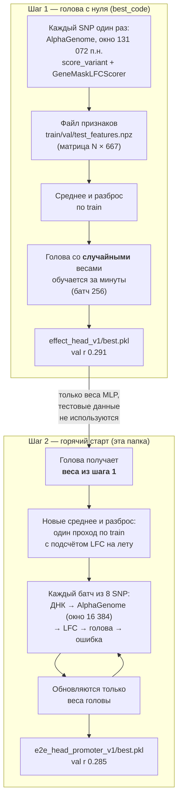

- **Холодный старт (шаг 1).** Веса головы случайные.  
- **Горячий старт (шаг 2).** Голова начинает с весов шага 1 — так обучение начинается с уже хорошей точки,
  а не с нуля. Среднее и разброс признаков пересчитываются заново, потому что признаки считаются
  по-другому . Каждый шаг обучения требует двух полных прогонов AlphaGenome
  (ref и alt), поэтому эпоха (4009 шагов по 8 SNP) идёт часами. Тестовая таблица не участвует ни в обучении, ни в выборе эпохи, ни в нормировке.

### 4. Путь одного SNP через код

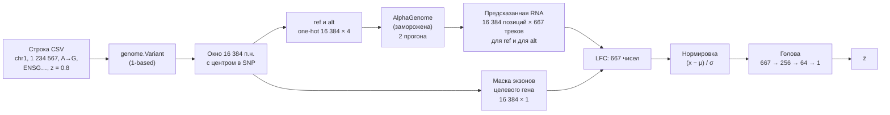

### 5. Формулы

**Окно.** Длина $W = 16\,384$ п.н., центр — позиция SNP. Последовательности ref и alt кодируются one-hot:
матрицы $W \times 4$.

**Предсказание AlphaGenome.** Для ref и alt модель выдаёт RNA-сигнал с разрешением 1 п.н. 

**LFC по маске гена** (официальная формула AlphaGenome, `GENE_MASK_LFC`). Пусть $G$ — множество позиций окна,
попавших в экзоны целевого гена, $|G|$ — их число. Для каждого трека $t$ считается **средний** сигнал по экзонам:

$$
\bar{R}^{\mathrm{ref}}_t = \frac{1}{|G|} \sum_{i \in G} R^{\mathrm{ref}}_{i,t},
\qquad
\bar{R}^{\mathrm{alt}}_t = \frac{1}{|G|} \sum_{i \in G} R^{\mathrm{alt}}_{i,t}
$$

$$
x_t = \ln\left(\bar{R}^{\mathrm{alt}}_t + 10^{-3}\right) - \ln\left(\bar{R}^{\mathrm{ref}}_t + 10^{-3}\right)
$$

Словами: «во сколько раз (в логарифме) изменится средняя экспрессия гена в этом типе клеток, если заменить
нуклеотид». Получаем вектор $\mathbf{x} \in \mathbb{R}^{667}$. Значения NaN/∞ заменяются нулём,
затем обрезка $x_t \in [-20, 20]$.

**Нормировка.** Один раз по всем $N$ обучающим SNP считаются среднее и стандартное отклонение каждого трека:

$$
\mu_t = \frac{1}{N} \sum_{n=1}^{N} x_{n,t},
\qquad
\sigma_t = \sqrt{\frac{1}{N} \sum_{n=1}^{N} \left(x_{n,t} - \mu_t\right)^2}
$$

$$
\tilde{x}_t = \mathrm{clip}\left(\frac{x_t - \mu_t}{\sigma_t},\; -50,\; 50\right)
$$

Если $\sigma_t < 10^{-6}$ (трек почти постоянен), берётся $\sigma_t = 1$.

**Голова.** Двухслойная сеть с ReLU $\phi(u) = \max(u, 0)$ и dropout 0.2 во время обучения:

$$
\mathbf{h}_1 = \phi\left(W_1 \tilde{\mathbf{x}} + \mathbf{b}_1\right) \in \mathbb{R}^{256},
\qquad
\mathbf{h}_2 = \phi\left(W_2 \mathbf{h}_1 + \mathbf{b}_2\right) \in \mathbb{R}^{64},
\qquad
\hat{z} = \mathbf{w}_z^{\top} \mathbf{h}_2 + b_z
$$

Число параметров: $667 \cdot 256 + 256 + 256 \cdot 64 + 64 + 64 + 1 \approx 1.9 \cdot 10^5$.

**Функция ошибки — Huber** с $\delta = 1$, среднее по строкам с известным $z$:

$$
\mathrm{Huber}(r) =
\begin{cases}
\dfrac{1}{2} r^2, & |r| \le \delta \\
\delta \left(|r| - \dfrac{1}{2}\delta\right), & |r| > \delta
\end{cases}
\qquad
L = \frac{1}{B} \sum_{n=1}^{B} \mathrm{Huber}\left(\hat{z}_n - z_n\right)
$$

Малые ошибки штрафуются квадратично, большие — линейно, поэтому редкие варианты с огромным $|z|$
(максимум около 8 при стандартном отклонении около 0.45) не перетягивают обучение.

**Оптимизация.** AdamW (weight decay $10^{-4}$), обрезка нормы градиента до 1. Скорость обучения:
линейный разогрев от $10^{-4}$ до $10^{-3}$ за 50 шагов, затем косинусное затухание до $10^{-5}$.
Градиент считается **только по весам головы**: веса AlphaGenome участвуют в вычислении $\mathbf{x}$,
но в оптимизатор не передаются.

**Ранняя остановка.** После каждой эпохи — корреляция Пирсона на валидации:

$$
r = \frac{\sum_n (\hat{z}_n - \bar{\hat{z}})(z_n - \bar{z})}{\sqrt{\sum_n (\hat{z}_n - \bar{\hat{z}})^2} \sqrt{\sum_n (z_n - \bar{z})^2}}
$$

Сохраняются веса эпохи с максимальным $r$; после 15 эпох без улучшения обучение останавливается.

**Тест (AUC по парам классов).** Для пары, например over против none, берутся только варианты этих двух
классов, и считается площадь под ROC-кривой, где оценка — $\hat{z}$:

$$
\mathrm{AUC} = P\left(\hat{z}_{\mathrm{over}} > \hat{z}_{\mathrm{none}}\right)
$$

— вероятность того, что случайный over получит большее предсказание, чем случайный none.
Если AUC < 0.5, берётся $1 - \mathrm{AUC}$ (как в курсовом Random Forest), чтобы сравнение было честным.

### 6. Тонкости, которые влияют на результат

- **Маска гена.** Строится по экзонам из GENCODE v39 (`GeneMaskType.EXONS`). В окне может оказаться
  несколько генов; берётся столбец именно того гена, что указан в строке CSV (сначала по `gene_id`
  без версии, затем по имени гена). Если ген не найден — строка выбрасывается при фильтрации.
- **Один и тот же признак, что у официального API.** На шаге 1 признаки считались через
  `model.score_variant(..., GeneMaskLFCScorer)`, на шаге 2 — через ту же внутреннюю функцию
  `gene_mask._score_gene_variant`, но внутри графа JAX. Формула совпадает; отличается только окно.
- **Окно 16 384 вместо 131 072.** Меньшее окно выбрано, чтобы батч из 8 пар ref/alt поместился в память GPU
  на каждом шаге обучения. Цена — чуть другие предсказания RNA: голова шага 1 на новых признаках дала 0.253
  вместо 0.291.
- **Точность вычислений.** AlphaGenome считает в bfloat16 (веса в float32) — так же, как на шаге 1.
- **Нормировка — только по train.** Валидация и тест не участвуют в вычислении $\mu$ и $\sigma$;
  при оценке используются сохранённые в `best.pkl` значения.
- **Кэш последовательностей.** Вырезанные one-hot и маски хранятся в памяти (до 8192 вариантов),
  чтобы не читать FASTA повторно; сами LFC не кэшируются — их каждый раз считает AlphaGenome.

### 7. Что пробовалось и не вошло

| Попытка | Что вышло | Почему отказались |
|---|---|---|
| Разморозка AlphaGenome через LoRA с весами головы из шага 1 (код не публиковался) | Val r 0.02–0.03 после двух эпох; при большом батче — нехватка памяти (запрос 18.75 ГБ) | Качество обвалилось сразу; горячий старт головы без LoRA стабильнее |
| Кэш последовательностей на диске вместо вырезки на лету | Окно кэша (16 384 п.н.) разошлось с окном, на котором считались признаки (около 32 000 п.н.) | Источник тихих ошибок; заменён вырезкой из FASTA на каждом шаге |
| Обучение головы на признаках из файла ([шаг 1](../../best_code/README.md)) | **Лучший результат** | Остаётся основной моделью |
| Разморозка последнего слоя RNA-выхода ([`finetune_backbone.py`](../../best_code/finetune_backbone.py)) | Подготовлено, не запускалось на полных данных | Следующий кандидат на рост качества |

### 8. Ограничения и известные недостатки кода

- **AlphaGenome не учится.** Название «дообучение» относится к голове; признаки — от исходной модели.
- **Медленно.** На каждом шаге два полных прогона AlphaGenome; подсчёт нормировки — ещё один проход по всем 32 072 SNP.
- **Подсчёт нормировки делает лишнюю работу.** В `finetune_e2e_head_promoter.py` при подсчёте $\mu, \sigma$
  функция `stack_train(bi)` вызывается три раза на один батч вместо одного (на результат не влияет, только на время).
- **Фильтр молча пропускает ошибки.** `filter_promoter_rows` перехватывает любое исключение — опечатка
  в названии колонки выглядела бы как «гены не найдены».
- **Графики считаются второй раз.** `make_figures.py --e2e` заново прогоняет val и test через AlphaGenome,
  хотя `evaluate_e2e_promoter.py` это уже сделал.
- **Модели на GitHub нет.** `best.pkl` и веса AlphaGenome не публикуются; результат воспроизводится через
  `launch_e2e_head_ft.sh` на машине с данными.
